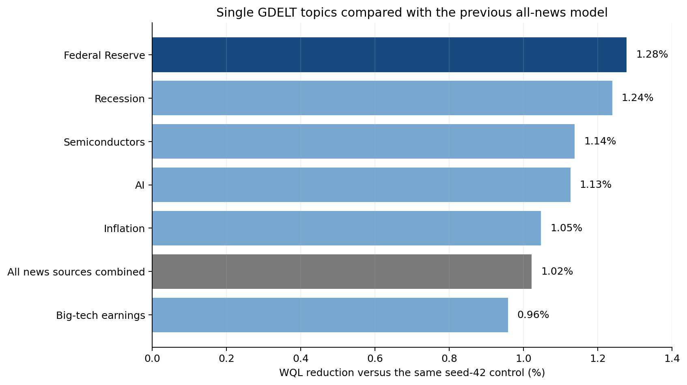

# GDELT single-topic fine-tuning results

## Result

**Federal Reserve news is the current winner.** Its fine-tuned model had the lowest weighted
quantile loss (WQL), `0.686526`, compared with `0.695413` for the seed-42 control. That is a
1.28% reduction in the main forecasting loss.

Recession news was extremely close at `0.686796`. The difference between Fed and recession
is too small to call reliable from this run: a direct paired bootstrap interval includes
zero. The earlier model trained with all external/news sources is included below as the
eighth case; its WQL was `0.688303`. The next confirmation test should therefore repeat both
Fed and recession with seeds 43 and 44.

Lower WQL and average error are better. “Correct directions” counts whether the median
forecast had the same positive or negative sign as the realized daily QQQ return.

| Rank | News data used | WQL | WQL reduction vs control | Correct directions | Average daily error |
|---:|---|---:|---:|---:|---:|
| 1 | Federal Reserve | **0.686526** | **1.28%** | 144/250 (57.6%) | 0.841 percentage points |
| 2 | Recession | 0.686796 | 1.24% | 144/250 (57.6%) | 0.843 percentage points |
| 3 | Semiconductors | 0.687499 | 1.14% | 144/250 (57.6%) | 0.844 percentage points |
| 4 | AI | 0.687580 | 1.13% | 143/250 (57.2%) | 0.843 percentage points |
| 5 | Inflation | 0.688131 | 1.05% | 142/250 (56.8%) | 0.843 percentage points |
| 6 | **All external/news sources combined** | **0.688303** | **1.02%** | **145/250 (58.0%)** | **0.842 percentage points** |
| 7 | Big-tech earnings | 0.688750 | 0.96% | 142/250 (56.8%) | 0.845 percentage points |
| — | Control: no news | 0.695413 | — | 140/250 (56.0%) | 0.848 percentage points |

All six single-topic runs beat the fine-tuned control on WQL. Their paired 95% bootstrap
intervals versus control were also entirely below zero in this seed-42 run. This is stronger
within-run evidence than the earlier all-topic result, but it is still development
validation using one training seed.

The “all external/news sources combined” row is the previous `all_external` fine-tune. It
used 42 total features: the 21 controls plus EPU/EMU, classifier-derived FOMC tone, SEC and
earnings activity, and all 12 GDELT share/tone signals. It had the best direction count,
145 of 250, but five isolated topics had lower WQL.

## What each model received

Every run started from the same original pinned pretrained Chronos-2 weights. It did not
start from the previously fine-tuned control adapter. We then trained a fresh LoRA adapter
with:

- the same 21 market, QQQ, rates, macro, and known-calendar control features;
- exactly one topic's `news_share` and `average_tone` columns;
- no GDELT counts and no other GDELT topic;
- seed 42, 200 optimizer steps, batch size 8, and learning rate 1e-5.

For example, the Fed model received the 21 controls plus `gdelt_fed_news_share` and
`gdelt_fed_avg_tone`. The AI model instead received the same controls plus
`gdelt_ai_news_share` and `gdelt_ai_avg_tone`.

Training used 2,133 sessions from 2017-01-03 through 2025-06-27. Evaluation used the same
250 realized daily QQQ returns as the control: 50 forecast origins, with five separate daily
returns predicted at each origin, from 2025-06-30 through 2026-06-26. Two tail sessions in
the 252-session validation allocation were not used because they cannot form a complete
five-day block.

## How stable is the ranking?

Fed beat control in 34 of the 50 forecast blocks; recession beat control in 35, semiconductor
in 34, AI in 32, inflation in 31, and big-tech earnings in 33. Fed ranks first because the
size of its improvements was slightly larger overall, even though recession won one more
block.

The direct Fed-minus-recession WQL difference was `-0.000269`. Its paired 95% interval was
`-0.002163` to `0.001596`, so this experiment does not distinguish those two topics. The
same is true for Fed versus every other single topic: Fed has the best point estimate, while
the topic-to-topic intervals still overlap zero.

The separate model with the 21 controls plus all six GDELT topics, but without the other
external sources, had WQL `0.692348`, worse than every isolated topic. Adding all 12 GDELT
fields can introduce redundant or conflicting signals, and the small LoRA fit may not
separate them well. This result supports using a small topic subset; it does not show that
the other topics contain no information.

## Files

- `models/news-ablation-869989/gdelt_topic_plus_all_news_comparison.csv` is the complete
  eight-case table shown above.
- `models/news-ablation-869989/gdelt_topic_ranking.csv` contains only the six isolated topics.
- `models/news-ablation-869989/news_ablation_ranking.csv` compares these runs with every
  earlier source experiment.
- Each `models/news-ablation-869989/gdelt_TOPIC-seed42/` directory contains the exact 250
  predictions, per-horizon and overall metrics, metadata, and its LoRA checkpoint.
- `configs/news_ablation.json` records the feature list and all fixed training settings.

TAU Slurm array `874192` completed all six tasks with exit code 0 on an NVIDIA GeForce RTX
2080 Ti. Every metadata file records the same model revision and feature-table SHA-256:
`e0c8d48b38059eb70d9f91931bff68678dbcc46aeadab1502ded1b9ee11df037`.
