# Permutation importance (swap between validation windows)

Positive values: the forecast got worse when the feature was replaced by the same feature from another window, i.e. the model was using it. Relative = mean of dWQL / baseline WQL per window.

## r3_qqq_calendar_market-fold2022-seed42-finetuned

50 windows x 3 repeats; baseline mean WQL 0.695530.

| Rank | Feature | Mean dWQL | Relative | Std | Windows > 0 | H1 | H2 | H3 | H4 | H5 |
|---:|---|---:|---:|---:|---:|---:|---:|---:|---:|---:|
| 1 | `parkinson_vol_1d` | +0.00109 | +0.17% | 0.02357 | 52% | +0.00682 | -0.00582 | -0.00006 | +0.00267 | +0.00185 |
| 2 | `d_dfii10_bp` | +0.00067 | +0.09% | 0.00579 | 53% | +0.00054 | +0.00203 | +0.00146 | +0.00052 | -0.00121 |
| 3 | `vxn_minus_vix` | +0.00060 | +0.08% | 0.00416 | 51% | +0.00126 | -0.00067 | +0.00119 | +0.00143 | -0.00019 |
| 4 | `is_opex_week` (known-future) | +0.00033 | +0.04% | 0.00214 | 52% | +0.00022 | +0.00028 | +0.00048 | +0.00099 | -0.00033 |
| 5 | `is_nfp_day` (known-future) | +0.00028 | +0.04% | 0.00323 | 53% | +0.00205 | +0.00004 | +0.00050 | -0.00021 | -0.00099 |
| 6 | `tlt_log_ret` | +0.00022 | +0.03% | 0.00600 | 52% | -0.00023 | -0.00044 | +0.00186 | +0.00141 | -0.00149 |
| 7 | `volume_z_20d` | +0.00018 | +0.03% | 0.00457 | 53% | -0.00138 | +0.00082 | +0.00057 | +0.00132 | -0.00043 |
| 8 | `vix_term_ratio` | +0.00004 | +0.01% | 0.00351 | 53% | +0.00077 | -0.00022 | -0.00049 | +0.00053 | -0.00040 |
| 9 | `days_to_month_end` (known-future) | -0.00001 | -0.01% | 0.00194 | 48% | +0.00019 | +0.00039 | -0.00038 | -0.00030 | +0.00006 |
| 10 | `cpi_yoy` | -0.00010 | -0.01% | 0.00123 | 45% | -0.00016 | -0.00041 | -0.00030 | +0.00005 | +0.00030 |
| 11 | `days_to_fomc` (known-future) | -0.00012 | -0.02% | 0.00332 | 46% | +0.00164 | +0.00020 | -0.00068 | -0.00078 | -0.00097 |
| 12 | `is_cpi_day` (known-future) | -0.00014 | -0.03% | 0.00243 | 49% | +0.00028 | -0.00074 | -0.00013 | -0.00005 | -0.00005 |
| 13 | `hyg_log_ret` | -0.00016 | -0.03% | 0.00894 | 50% | +0.00145 | +0.00226 | -0.00137 | -0.00304 | -0.00010 |
| 14 | `is_fomc_day` (known-future) | -0.00026 | -0.04% | 0.00207 | 35% | -0.00039 | +0.00005 | -0.00039 | -0.00028 | -0.00031 |
| 15 | `t10y2y_lag1` | -0.00027 | -0.04% | 0.00183 | 47% | -0.00065 | -0.00028 | +0.00004 | -0.00023 | -0.00023 |
| 16 | `d_dgs2_bp` | -0.00033 | -0.05% | 0.01244 | 49% | -0.00486 | +0.00031 | +0.00058 | +0.00160 | +0.00072 |
| 17 | `dist_200dma` | -0.00087 | -0.11% | 0.00502 | 48% | -0.00280 | -0.00009 | -0.00099 | -0.00030 | -0.00015 |
| 18 | `parkinson_vol_22d` | -0.00090 | -0.13% | 0.00591 | 47% | -0.00048 | -0.00116 | -0.00165 | -0.00181 | +0.00060 |
| 19 | `mom_21d` | -0.00161 | -0.21% | 0.00808 | 37% | -0.00346 | -0.00003 | -0.00223 | -0.00037 | -0.00196 |
| 20 | `overnight_gap` | -0.00297 | -0.47% | 0.04295 | 48% | -0.00357 | -0.00156 | +0.00293 | -0.00340 | -0.00926 |
| 21 | `vxn_log_chg` | -0.00332 | -0.45% | 0.02340 | 49% | -0.00508 | -0.00248 | -0.00807 | -0.00175 | +0.00078 |

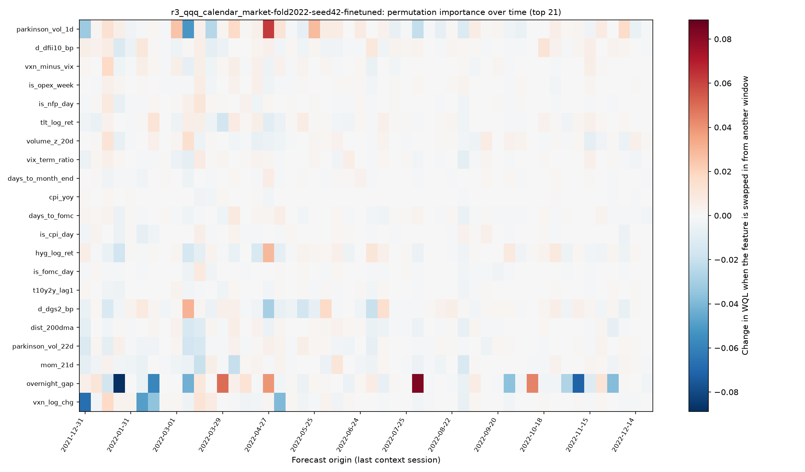

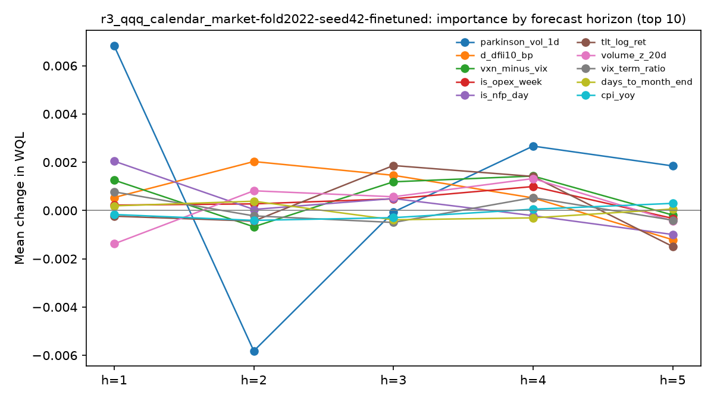

## r3_qqq_calendar_market-fold2022-seed42-pretrained

50 windows x 3 repeats; baseline mean WQL 0.696062.

| Rank | Feature | Mean dWQL | Relative | Std | Windows > 0 | H1 | H2 | H3 | H4 | H5 |
|---:|---|---:|---:|---:|---:|---:|---:|---:|---:|---:|
| 1 | `d_dfii10_bp` | +0.00108 | +0.14% | 0.00952 | 53% | -0.00018 | +0.00446 | +0.00288 | -0.00040 | -0.00138 |
| 2 | `parkinson_vol_1d` | +0.00098 | +0.16% | 0.02976 | 53% | +0.00722 | -0.00751 | -0.00014 | +0.00326 | +0.00207 |
| 3 | `vxn_minus_vix` | +0.00085 | +0.12% | 0.00553 | 57% | +0.00151 | -0.00044 | +0.00137 | +0.00154 | +0.00027 |
| 4 | `is_nfp_day` (known-future) | +0.00033 | +0.05% | 0.00418 | 55% | +0.00265 | -0.00031 | +0.00086 | -0.00060 | -0.00096 |
| 5 | `is_opex_week` (known-future) | +0.00028 | +0.03% | 0.00304 | 51% | -0.00014 | +0.00002 | +0.00066 | +0.00110 | -0.00023 |
| 6 | `hyg_log_ret` | +0.00017 | +0.01% | 0.01197 | 52% | +0.00275 | +0.00424 | -0.00242 | -0.00404 | +0.00034 |
| 7 | `cpi_yoy` | -0.00002 | +0.00% | 0.00164 | 53% | +0.00011 | +0.00000 | -0.00036 | -0.00035 | +0.00051 |
| 8 | `tlt_log_ret` | -0.00007 | -0.01% | 0.00828 | 52% | -0.00093 | -0.00129 | +0.00285 | +0.00107 | -0.00204 |
| 9 | `days_to_month_end` (known-future) | -0.00013 | -0.02% | 0.00272 | 47% | +0.00004 | +0.00074 | -0.00058 | -0.00064 | -0.00022 |
| 10 | `volume_z_20d` | -0.00021 | -0.03% | 0.00616 | 53% | -0.00274 | +0.00166 | -0.00051 | +0.00115 | -0.00060 |
| 11 | `days_to_fomc` (known-future) | -0.00025 | -0.04% | 0.00517 | 48% | +0.00119 | +0.00077 | -0.00073 | -0.00145 | -0.00103 |
| 12 | `is_cpi_day` (known-future) | -0.00027 | -0.05% | 0.00296 | 50% | -0.00042 | -0.00075 | -0.00038 | +0.00051 | -0.00031 |
| 13 | `is_fomc_day` (known-future) | -0.00038 | -0.05% | 0.00256 | 40% | -0.00075 | +0.00005 | -0.00038 | -0.00073 | -0.00008 |
| 14 | `vix_term_ratio` | -0.00040 | -0.05% | 0.00461 | 49% | -0.00054 | -0.00040 | -0.00123 | +0.00066 | -0.00048 |
| 15 | `t10y2y_lag1` | -0.00050 | -0.07% | 0.00260 | 44% | -0.00170 | -0.00037 | +0.00009 | -0.00000 | -0.00053 |
| 16 | `dist_200dma` | -0.00123 | -0.16% | 0.00677 | 46% | -0.00419 | -0.00001 | -0.00059 | -0.00091 | -0.00043 |
| 17 | `parkinson_vol_22d` | -0.00140 | -0.19% | 0.00869 | 48% | -0.00293 | -0.00156 | -0.00199 | -0.00168 | +0.00117 |
| 18 | `mom_21d` | -0.00189 | -0.24% | 0.01099 | 42% | -0.00404 | -0.00015 | -0.00252 | -0.00065 | -0.00209 |
| 19 | `d_dgs2_bp` | -0.00200 | -0.29% | 0.01721 | 51% | -0.01083 | +0.00034 | -0.00118 | +0.00049 | +0.00117 |
| 20 | `overnight_gap` | -0.00302 | -0.48% | 0.04765 | 43% | -0.00390 | -0.00079 | +0.00290 | -0.00426 | -0.00904 |
| 21 | `vxn_log_chg` | -0.00402 | -0.55% | 0.02526 | 49% | -0.00678 | -0.00320 | -0.00883 | -0.00201 | +0.00072 |

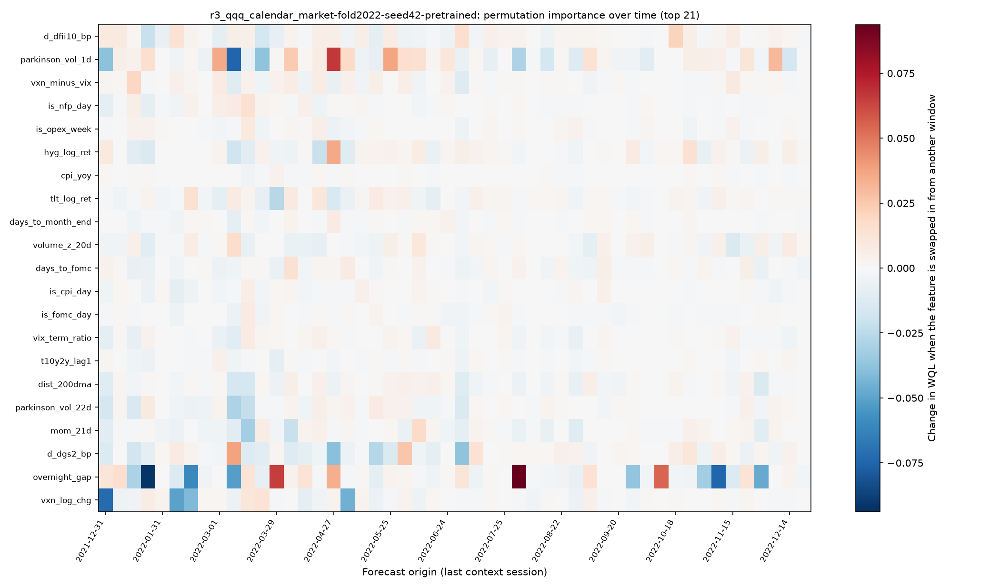

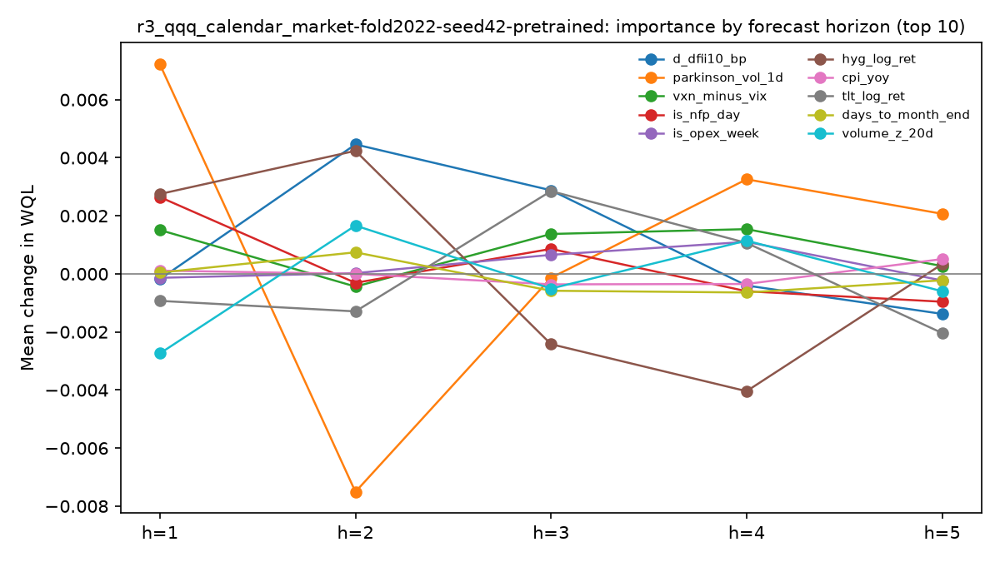

## r3_qqq_calendar_market-fold2025-seed42-finetuned

50 windows x 3 repeats; baseline mean WQL 0.712760.

| Rank | Feature | Mean dWQL | Relative | Std | Windows > 0 | H1 | H2 | H3 | H4 | H5 |
|---:|---|---:|---:|---:|---:|---:|---:|---:|---:|---:|
| 1 | `dist_200dma` | +0.00252 | +0.26% | 0.01112 | 62% | +0.00261 | +0.00234 | +0.00295 | +0.00278 | +0.00191 |
| 2 | `parkinson_vol_22d` | +0.00091 | +0.11% | 0.00772 | 64% | +0.00097 | +0.00116 | -0.00095 | +0.00283 | +0.00052 |
| 3 | `vix_term_ratio` | +0.00086 | +0.08% | 0.00574 | 51% | -0.00076 | +0.00189 | +0.00098 | +0.00102 | +0.00116 |
| 4 | `mom_21d` | +0.00073 | +0.06% | 0.00815 | 53% | +0.00188 | +0.00170 | -0.00087 | +0.00088 | +0.00005 |
| 5 | `t10y2y_lag1` | +0.00062 | +0.06% | 0.00364 | 53% | +0.00066 | +0.00017 | +0.00099 | +0.00025 | +0.00103 |
| 6 | `is_cpi_day` (known-future) | +0.00009 | +0.02% | 0.00364 | 57% | -0.00056 | +0.00052 | +0.00070 | +0.00049 | -0.00068 |
| 7 | `is_nfp_day` (known-future) | -0.00003 | -0.04% | 0.00711 | 55% | -0.00057 | +0.00096 | -0.00155 | +0.00076 | +0.00024 |
| 8 | `days_to_month_end` (known-future) | -0.00010 | -0.00% | 0.00340 | 53% | -0.00031 | -0.00001 | +0.00073 | -0.00065 | -0.00025 |
| 9 | `vxn_minus_vix` | -0.00015 | -0.00% | 0.00542 | 46% | -0.00096 | +0.00118 | -0.00067 | -0.00068 | +0.00038 |
| 10 | `cpi_yoy` | -0.00015 | -0.01% | 0.00202 | 43% | -0.00001 | +0.00021 | -0.00046 | -0.00023 | -0.00027 |
| 11 | `is_opex_week` (known-future) | -0.00022 | -0.03% | 0.00328 | 49% | -0.00088 | -0.00021 | +0.00001 | -0.00109 | +0.00105 |
| 12 | `d_dgs2_bp` | -0.00023 | -0.04% | 0.00532 | 56% | -0.00059 | +0.00010 | +0.00074 | -0.00032 | -0.00110 |
| 13 | `days_to_fomc` (known-future) | -0.00040 | -0.07% | 0.00694 | 50% | -0.00361 | +0.00023 | +0.00115 | -0.00015 | +0.00039 |
| 14 | `is_fomc_day` (known-future) | -0.00061 | -0.11% | 0.00476 | 48% | -0.00102 | -0.00135 | +0.00076 | -0.00076 | -0.00066 |
| 15 | `d_dfii10_bp` | -0.00087 | -0.12% | 0.00638 | 45% | -0.00096 | -0.00208 | -0.00021 | -0.00062 | -0.00047 |
| 16 | `tlt_log_ret` | -0.00197 | -0.26% | 0.00723 | 41% | -0.00091 | -0.00361 | -0.00133 | -0.00189 | -0.00210 |
| 17 | `volume_z_20d` | -0.00204 | -0.25% | 0.00599 | 42% | -0.00197 | -0.00482 | -0.00059 | -0.00130 | -0.00155 |
| 18 | `parkinson_vol_1d` | -0.00326 | -0.45% | 0.02235 | 47% | -0.00563 | -0.00845 | -0.00278 | -0.00245 | +0.00303 |
| 19 | `hyg_log_ret` | -0.00397 | -0.52% | 0.02907 | 57% | -0.00455 | -0.00646 | -0.00292 | -0.00576 | -0.00013 |
| 20 | `overnight_gap` | -0.00597 | -0.84% | 0.03654 | 51% | -0.00470 | -0.00197 | -0.01179 | -0.00528 | -0.00613 |
| 21 | `vxn_log_chg` | -0.00908 | -1.06% | 0.05857 | 47% | -0.00565 | -0.01849 | +0.00285 | -0.02404 | -0.00009 |

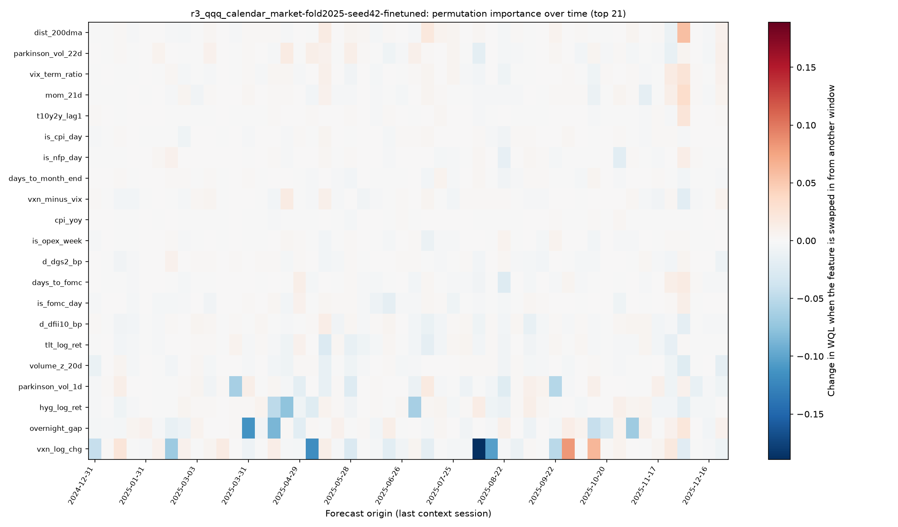

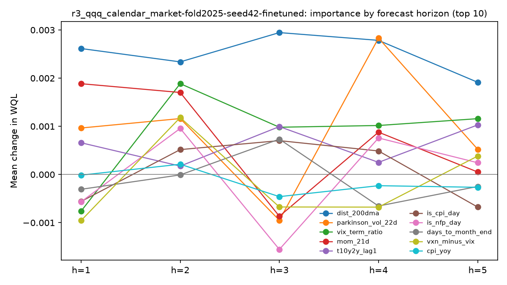

## r3_qqq_calendar_market-fold2025-seed42-pretrained

50 windows x 3 repeats; baseline mean WQL 0.707039.

| Rank | Feature | Mean dWQL | Relative | Std | Windows > 0 | H1 | H2 | H3 | H4 | H5 |
|---:|---|---:|---:|---:|---:|---:|---:|---:|---:|---:|
| 1 | `dist_200dma` | +0.00284 | +0.30% | 0.01301 | 62% | +0.00136 | +0.00318 | +0.00408 | +0.00327 | +0.00229 |
| 2 | `parkinson_vol_22d` | +0.00196 | +0.25% | 0.00899 | 57% | +0.00232 | +0.00256 | -0.00065 | +0.00401 | +0.00157 |
| 3 | `vix_term_ratio` | +0.00174 | +0.19% | 0.00866 | 53% | -0.00071 | +0.00319 | +0.00245 | +0.00115 | +0.00263 |
| 4 | `t10y2y_lag1` | +0.00076 | +0.09% | 0.00384 | 57% | +0.00079 | +0.00008 | +0.00141 | +0.00001 | +0.00151 |
| 5 | `mom_21d` | +0.00062 | +0.04% | 0.01303 | 51% | +0.00225 | +0.00296 | -0.00289 | +0.00110 | -0.00031 |
| 6 | `days_to_fomc` (known-future) | +0.00028 | +0.03% | 0.01033 | 50% | -0.00501 | +0.00203 | +0.00308 | -0.00041 | +0.00170 |
| 7 | `is_nfp_day` (known-future) | +0.00011 | -0.02% | 0.00868 | 50% | -0.00151 | +0.00231 | -0.00194 | +0.00089 | +0.00081 |
| 8 | `d_dgs2_bp` | +0.00008 | +0.01% | 0.00709 | 57% | +0.00075 | +0.00011 | +0.00153 | -0.00086 | -0.00113 |
| 9 | `is_cpi_day` (known-future) | +0.00008 | +0.01% | 0.00560 | 56% | -0.00061 | +0.00098 | +0.00113 | +0.00037 | -0.00146 |
| 10 | `cpi_yoy` | -0.00014 | -0.01% | 0.00243 | 44% | +0.00014 | +0.00056 | -0.00059 | -0.00040 | -0.00039 |
| 11 | `days_to_month_end` (known-future) | -0.00021 | -0.02% | 0.00509 | 49% | +0.00012 | -0.00059 | +0.00065 | -0.00122 | -0.00000 |
| 12 | `vxn_minus_vix` | -0.00035 | -0.04% | 0.00711 | 49% | -0.00142 | +0.00192 | -0.00133 | -0.00167 | +0.00076 |
| 13 | `tlt_log_ret` | -0.00065 | -0.10% | 0.00995 | 43% | +0.00213 | -0.00337 | -0.00002 | -0.00052 | -0.00148 |
| 14 | `is_opex_week` (known-future) | -0.00065 | -0.09% | 0.00433 | 40% | -0.00234 | -0.00033 | +0.00009 | -0.00182 | +0.00113 |
| 15 | `is_fomc_day` (known-future) | -0.00089 | -0.17% | 0.00797 | 49% | -0.00033 | -0.00114 | +0.00118 | -0.00219 | -0.00195 |
| 16 | `volume_z_20d` | -0.00101 | -0.13% | 0.00733 | 47% | +0.00014 | -0.00377 | +0.00068 | -0.00185 | -0.00027 |
| 17 | `d_dfii10_bp` | -0.00146 | -0.23% | 0.00983 | 45% | -0.00189 | -0.00575 | +0.00100 | -0.00037 | -0.00028 |
| 18 | `parkinson_vol_1d` | -0.00285 | -0.39% | 0.03222 | 53% | -0.00452 | -0.00970 | -0.00202 | -0.00416 | +0.00617 |
| 19 | `hyg_log_ret` | -0.00408 | -0.55% | 0.03577 | 57% | -0.00192 | -0.00965 | -0.00139 | -0.00800 | +0.00059 |
| 20 | `overnight_gap` | -0.00460 | -0.68% | 0.04212 | 55% | -0.00383 | +0.00045 | -0.01293 | -0.00184 | -0.00484 |
| 21 | `vxn_log_chg` | -0.00708 | -0.78% | 0.06322 | 50% | -0.00087 | -0.01612 | +0.00631 | -0.02596 | +0.00124 |

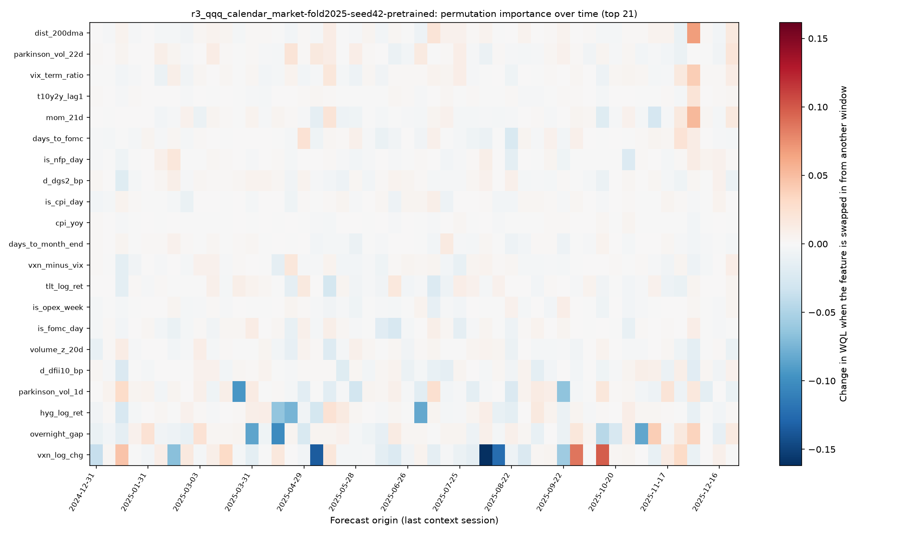

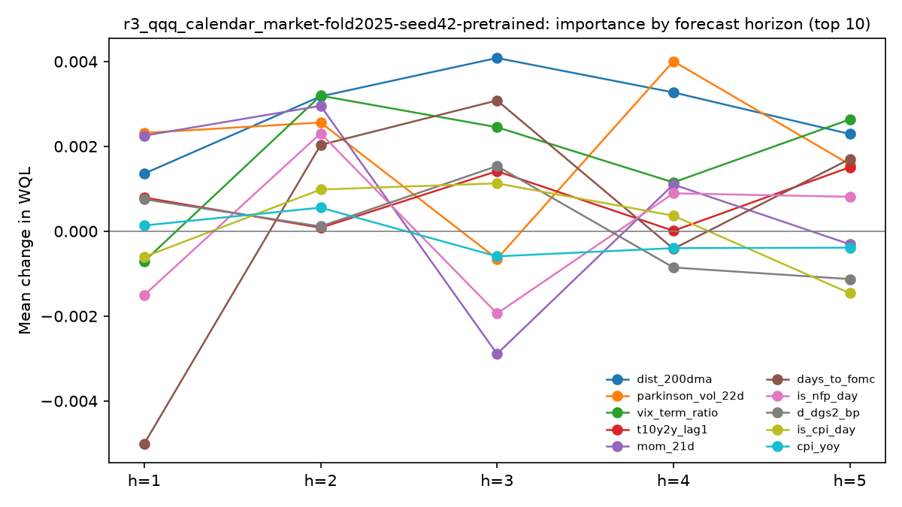

## r5_plus_fed-fold2022-seed42-finetuned

50 windows x 3 repeats; baseline mean WQL 0.694860.

| Rank | Feature | Mean dWQL | Relative | Std | Windows > 0 | H1 | H2 | H3 | H4 | H5 |
|---:|---|---:|---:|---:|---:|---:|---:|---:|---:|---:|
| 1 | `parkinson_vol_1d` | +0.00163 | +0.25% | 0.02327 | 53% | +0.00622 | -0.00528 | +0.00271 | +0.00226 | +0.00225 |
| 2 | `vxn_minus_vix` | +0.00075 | +0.10% | 0.00382 | 55% | +0.00052 | +0.00045 | +0.00159 | +0.00120 | -0.00001 |
| 3 | `tlt_log_ret` | +0.00063 | +0.09% | 0.00672 | 56% | +0.00008 | +0.00010 | +0.00318 | +0.00085 | -0.00106 |
| 4 | `hyg_log_ret` | +0.00047 | +0.06% | 0.00839 | 50% | +0.00245 | +0.00273 | -0.00007 | -0.00303 | +0.00026 |
| 5 | `d_dfii10_bp` | +0.00038 | +0.05% | 0.00585 | 55% | -0.00019 | +0.00207 | +0.00133 | -0.00045 | -0.00084 |
| 6 | `is_opex_week` (known-future) | +0.00025 | +0.03% | 0.00235 | 51% | -0.00024 | +0.00015 | +0.00043 | +0.00104 | -0.00014 |
| 7 | `fomc_net_hawkish_last` | +0.00020 | +0.03% | 0.00099 | 55% | +0.00039 | +0.00016 | +0.00039 | +0.00005 | +0.00000 |
| 8 | `days_to_month_end` (known-future) | +0.00013 | +0.01% | 0.00207 | 51% | +0.00056 | +0.00032 | +0.00020 | -0.00053 | +0.00013 |
| 9 | `days_since_fomc` | +0.00012 | +0.02% | 0.00382 | 56% | -0.00095 | +0.00095 | +0.00053 | +0.00091 | -0.00081 |
| 10 | `volume_z_20d` | +0.00011 | +0.03% | 0.00589 | 53% | -0.00070 | +0.00008 | +0.00085 | +0.00066 | -0.00032 |
| 11 | `is_nfp_day` (known-future) | +0.00009 | +0.02% | 0.00234 | 48% | +0.00143 | -0.00014 | +0.00022 | -0.00057 | -0.00048 |
| 12 | `cpi_yoy` | +0.00005 | +0.01% | 0.00104 | 55% | +0.00002 | +0.00012 | -0.00007 | -0.00013 | +0.00032 |
| 13 | `is_cpi_day` (known-future) | -0.00002 | -0.01% | 0.00230 | 47% | +0.00070 | -0.00073 | -0.00021 | -0.00012 | +0.00024 |
| 14 | `fomc_net_hawkish_ewma` | -0.00003 | -0.01% | 0.00098 | 47% | +0.00014 | +0.00038 | -0.00040 | -0.00027 | -0.00001 |
| 15 | `fomc_tone_change_last` | -0.00009 | -0.01% | 0.00199 | 46% | +0.00007 | +0.00011 | -0.00008 | -0.00008 | -0.00048 |
| 16 | `days_to_fomc` (known-future) | -0.00013 | -0.02% | 0.00389 | 47% | +0.00215 | -0.00027 | -0.00021 | -0.00150 | -0.00081 |
| 17 | `epu_log` | -0.00023 | -0.03% | 0.00193 | 43% | +0.00088 | -0.00096 | -0.00047 | -0.00027 | -0.00034 |
| 18 | `vix_term_ratio` | -0.00025 | -0.03% | 0.00363 | 51% | +0.00012 | -0.00064 | -0.00065 | +0.00025 | -0.00034 |
| 19 | `t10y2y_lag1` | -0.00025 | -0.04% | 0.00160 | 41% | -0.00074 | -0.00033 | -0.00006 | +0.00005 | -0.00019 |
| 20 | `is_fomc_day` (known-future) | -0.00027 | -0.04% | 0.00235 | 41% | -0.00008 | -0.00008 | -0.00031 | -0.00083 | -0.00006 |
| 21 | `emu_log` | -0.00037 | -0.04% | 0.00272 | 48% | +0.00095 | -0.00100 | -0.00148 | -0.00026 | -0.00008 |
| 22 | `dist_200dma` | -0.00057 | -0.07% | 0.00401 | 49% | -0.00237 | +0.00075 | -0.00052 | -0.00091 | +0.00018 |
| 23 | `parkinson_vol_22d` | -0.00084 | -0.12% | 0.00614 | 46% | -0.00157 | -0.00080 | -0.00073 | -0.00139 | +0.00028 |
| 24 | `d_dgs2_bp` | -0.00096 | -0.14% | 0.01139 | 50% | -0.00346 | -0.00041 | +0.00001 | -0.00017 | -0.00074 |
| 25 | `mom_21d` | -0.00123 | -0.16% | 0.00750 | 47% | -0.00235 | +0.00052 | -0.00080 | -0.00140 | -0.00214 |
| 26 | `overnight_gap` | -0.00274 | -0.44% | 0.04758 | 46% | -0.00380 | -0.00092 | +0.00156 | -0.00352 | -0.00705 |
| 27 | `vxn_log_chg` | -0.00346 | -0.48% | 0.02547 | 47% | -0.00513 | -0.00255 | -0.00731 | -0.00320 | +0.00090 |

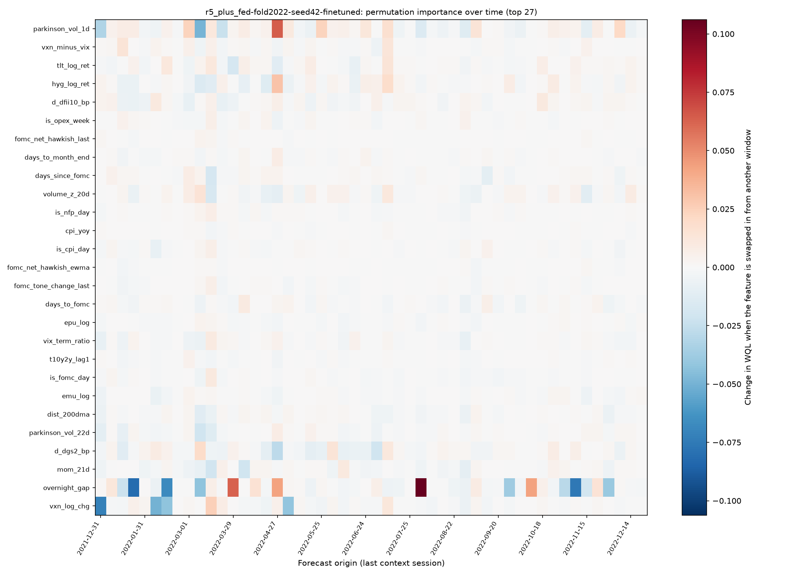

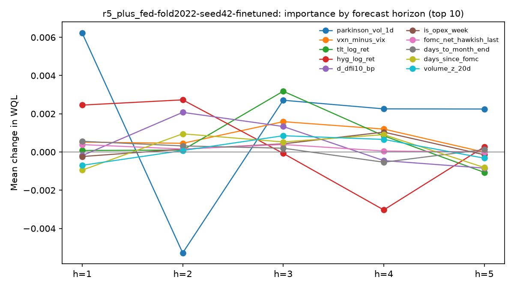

## r5_plus_fed-fold2022-seed42-pretrained

50 windows x 3 repeats; baseline mean WQL 0.695694.

| Rank | Feature | Mean dWQL | Relative | Std | Windows > 0 | H1 | H2 | H3 | H4 | H5 |
|---:|---|---:|---:|---:|---:|---:|---:|---:|---:|---:|
| 1 | `parkinson_vol_1d` | +0.00211 | +0.32% | 0.02649 | 51% | +0.00760 | -0.00656 | +0.00319 | +0.00386 | +0.00246 |
| 2 | `vxn_minus_vix` | +0.00094 | +0.13% | 0.00475 | 55% | +0.00108 | +0.00052 | +0.00119 | +0.00156 | +0.00033 |
| 3 | `hyg_log_ret` | +0.00057 | +0.07% | 0.00967 | 53% | +0.00317 | +0.00359 | -0.00135 | -0.00313 | +0.00059 |
| 4 | `is_nfp_day` (known-future) | +0.00048 | +0.08% | 0.00348 | 53% | +0.00235 | -0.00023 | +0.00078 | -0.00037 | -0.00015 |
| 5 | `d_dfii10_bp` | +0.00041 | +0.05% | 0.00840 | 56% | -0.00084 | +0.00287 | +0.00162 | -0.00025 | -0.00137 |
| 6 | `tlt_log_ret` | +0.00038 | +0.05% | 0.00822 | 55% | -0.00047 | -0.00123 | +0.00351 | +0.00139 | -0.00132 |
| 7 | `fomc_net_hawkish_last` | +0.00028 | +0.04% | 0.00141 | 56% | +0.00059 | +0.00026 | +0.00039 | +0.00017 | +0.00001 |
| 8 | `cpi_yoy` | +0.00019 | +0.03% | 0.00136 | 60% | +0.00031 | +0.00058 | -0.00011 | -0.00019 | +0.00037 |
| 9 | `is_opex_week` (known-future) | +0.00013 | +0.01% | 0.00348 | 49% | -0.00089 | -0.00033 | +0.00027 | +0.00172 | -0.00013 |
| 10 | `days_to_month_end` (known-future) | +0.00009 | +0.01% | 0.00276 | 47% | +0.00063 | +0.00056 | -0.00023 | -0.00044 | -0.00009 |
| 11 | `days_since_fomc` | +0.00005 | +0.01% | 0.00504 | 55% | -0.00179 | +0.00168 | +0.00015 | +0.00113 | -0.00090 |
| 12 | `fomc_net_hawkish_ewma` | +0.00000 | -0.00% | 0.00146 | 49% | +0.00007 | +0.00055 | -0.00046 | -0.00022 | +0.00007 |
| 13 | `volume_z_20d` | -0.00009 | +0.00% | 0.00754 | 53% | -0.00171 | +0.00091 | -0.00039 | +0.00071 | +0.00001 |
| 14 | `is_cpi_day` (known-future) | -0.00013 | -0.02% | 0.00287 | 44% | +0.00037 | -0.00067 | -0.00048 | +0.00014 | -0.00003 |
| 15 | `fomc_tone_change_last` | -0.00014 | -0.02% | 0.00268 | 44% | +0.00013 | -0.00003 | -0.00017 | +0.00004 | -0.00065 |
| 16 | `days_to_fomc` (known-future) | -0.00022 | -0.04% | 0.00622 | 45% | +0.00191 | -0.00072 | -0.00024 | -0.00124 | -0.00080 |
| 17 | `epu_log` | -0.00030 | -0.04% | 0.00289 | 45% | +0.00127 | -0.00134 | -0.00089 | -0.00015 | -0.00041 |
| 18 | `t10y2y_lag1` | -0.00035 | -0.05% | 0.00226 | 39% | -0.00124 | -0.00055 | -0.00018 | +0.00047 | -0.00023 |
| 19 | `vix_term_ratio` | -0.00039 | -0.05% | 0.00458 | 52% | -0.00025 | -0.00129 | -0.00090 | +0.00064 | -0.00017 |
| 20 | `is_fomc_day` (known-future) | -0.00046 | -0.07% | 0.00307 | 41% | -0.00010 | -0.00035 | -0.00074 | -0.00098 | -0.00011 |
| 21 | `emu_log` | -0.00049 | -0.06% | 0.00372 | 47% | +0.00066 | -0.00178 | -0.00172 | +0.00070 | -0.00032 |
| 22 | `dist_200dma` | -0.00066 | -0.08% | 0.00519 | 48% | -0.00262 | +0.00082 | -0.00028 | -0.00115 | -0.00008 |
| 23 | `mom_21d` | -0.00118 | -0.14% | 0.01048 | 49% | -0.00150 | +0.00036 | -0.00101 | -0.00145 | -0.00229 |
| 24 | `parkinson_vol_22d` | -0.00121 | -0.17% | 0.00770 | 49% | -0.00265 | -0.00133 | -0.00127 | -0.00132 | +0.00053 |
| 25 | `d_dgs2_bp` | -0.00266 | -0.36% | 0.01669 | 47% | -0.00948 | -0.00083 | -0.00266 | -0.00062 | +0.00029 |
| 26 | `overnight_gap` | -0.00286 | -0.45% | 0.04941 | 47% | -0.00423 | -0.00060 | +0.00105 | -0.00272 | -0.00781 |
| 27 | `vxn_log_chg` | -0.00431 | -0.60% | 0.02709 | 48% | -0.00703 | -0.00399 | -0.00809 | -0.00327 | +0.00080 |

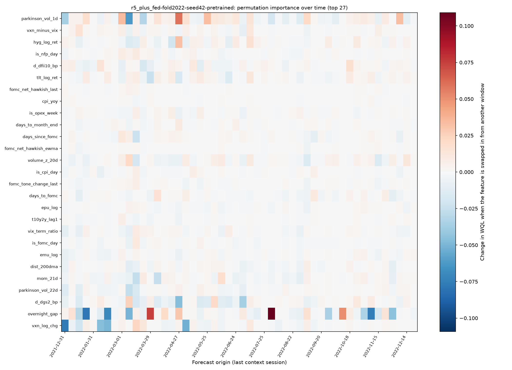

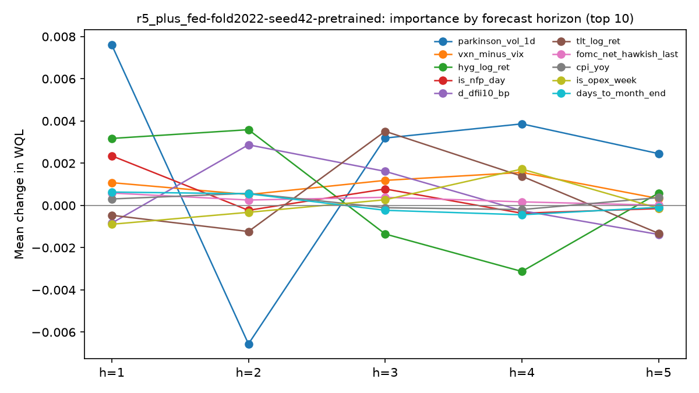

## r5_plus_fed-fold2025-seed42-finetuned

50 windows x 3 repeats; baseline mean WQL 0.711488.

| Rank | Feature | Mean dWQL | Relative | Std | Windows > 0 | H1 | H2 | H3 | H4 | H5 |
|---:|---|---:|---:|---:|---:|---:|---:|---:|---:|---:|
| 1 | `dist_200dma` | +0.00252 | +0.27% | 0.00944 | 65% | +0.00194 | +0.00279 | +0.00355 | +0.00254 | +0.00177 |
| 2 | `mom_21d` | +0.00105 | +0.09% | 0.00843 | 56% | +0.00148 | +0.00191 | -0.00044 | +0.00199 | +0.00034 |
| 3 | `days_to_fomc` (known-future) | +0.00070 | +0.09% | 0.01334 | 55% | -0.00220 | +0.00175 | +0.00368 | +0.00062 | -0.00037 |
| 4 | `fomc_tone_change_last` | +0.00036 | +0.05% | 0.00330 | 58% | +0.00121 | -0.00067 | +0.00001 | +0.00056 | +0.00068 |
| 5 | `t10y2y_lag1` | +0.00030 | +0.03% | 0.00226 | 46% | +0.00021 | -0.00025 | +0.00091 | +0.00015 | +0.00051 |
| 6 | `vix_term_ratio` | +0.00018 | +0.00% | 0.00454 | 52% | -0.00029 | +0.00175 | +0.00018 | -0.00096 | +0.00021 |
| 7 | `is_cpi_day` (known-future) | +0.00014 | +0.03% | 0.00247 | 51% | -0.00002 | +0.00044 | +0.00035 | +0.00030 | -0.00036 |
| 8 | `emu_log` | +0.00012 | +0.02% | 0.00221 | 51% | +0.00011 | -0.00014 | +0.00034 | +0.00040 | -0.00011 |
| 9 | `parkinson_vol_22d` | +0.00012 | +0.02% | 0.00612 | 57% | +0.00090 | -0.00026 | -0.00188 | +0.00180 | +0.00003 |
| 10 | `is_fomc_day` (known-future) | -0.00005 | -0.01% | 0.00349 | 53% | -0.00014 | -0.00157 | +0.00216 | -0.00074 | +0.00002 |
| 11 | `fomc_net_hawkish_ewma` | -0.00009 | -0.01% | 0.00183 | 51% | -0.00022 | +0.00006 | +0.00002 | -0.00015 | -0.00019 |
| 12 | `days_to_month_end` (known-future) | -0.00013 | -0.01% | 0.00274 | 55% | -0.00010 | -0.00032 | +0.00051 | -0.00019 | -0.00054 |
| 13 | `fomc_net_hawkish_last` | -0.00018 | -0.03% | 0.00174 | 40% | -0.00097 | +0.00007 | -0.00032 | +0.00029 | +0.00005 |
| 14 | `cpi_yoy` | -0.00023 | -0.03% | 0.00197 | 43% | -0.00001 | -0.00044 | -0.00027 | -0.00029 | -0.00012 |
| 15 | `is_nfp_day` (known-future) | -0.00023 | -0.07% | 0.00933 | 46% | -0.00088 | +0.00120 | -0.00310 | +0.00089 | +0.00072 |
| 16 | `vxn_minus_vix` | -0.00024 | -0.01% | 0.00664 | 43% | -0.00051 | +0.00060 | -0.00074 | -0.00106 | +0.00049 |
| 17 | `is_opex_week` (known-future) | -0.00026 | -0.03% | 0.00325 | 44% | -0.00067 | -0.00037 | -0.00026 | -0.00079 | +0.00080 |
| 18 | `epu_log` | -0.00032 | -0.05% | 0.00320 | 49% | -0.00039 | -0.00033 | +0.00006 | +0.00006 | -0.00098 |
| 19 | `d_dgs2_bp` | -0.00057 | -0.10% | 0.00491 | 47% | -0.00205 | -0.00080 | +0.00067 | +0.00046 | -0.00112 |
| 20 | `days_since_fomc` | -0.00071 | -0.12% | 0.00349 | 41% | -0.00068 | -0.00092 | +0.00000 | -0.00108 | -0.00084 |
| 21 | `parkinson_vol_1d` | -0.00159 | -0.23% | 0.01489 | 54% | -0.00301 | -0.00539 | -0.00163 | +0.00028 | +0.00181 |
| 22 | `d_dfii10_bp` | -0.00166 | -0.25% | 0.00745 | 38% | -0.00226 | -0.00257 | -0.00150 | -0.00025 | -0.00173 |
| 23 | `volume_z_20d` | -0.00183 | -0.25% | 0.00531 | 41% | -0.00328 | -0.00291 | -0.00067 | -0.00101 | -0.00126 |
| 24 | `tlt_log_ret` | -0.00266 | -0.36% | 0.00709 | 33% | -0.00313 | -0.00323 | -0.00222 | -0.00187 | -0.00284 |
| 25 | `hyg_log_ret` | -0.00299 | -0.39% | 0.02606 | 52% | -0.00349 | -0.00518 | -0.00120 | -0.00450 | -0.00057 |
| 26 | `overnight_gap` | -0.00585 | -0.83% | 0.03531 | 53% | -0.00600 | -0.00163 | -0.01060 | -0.00487 | -0.00613 |
| 27 | `vxn_log_chg` | -0.00985 | -1.18% | 0.06323 | 51% | -0.00659 | -0.01957 | +0.00158 | -0.02550 | +0.00084 |

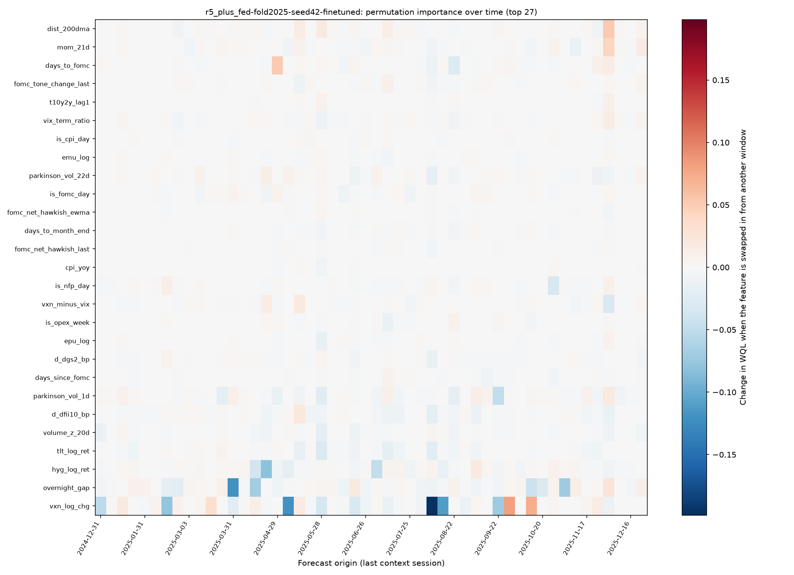

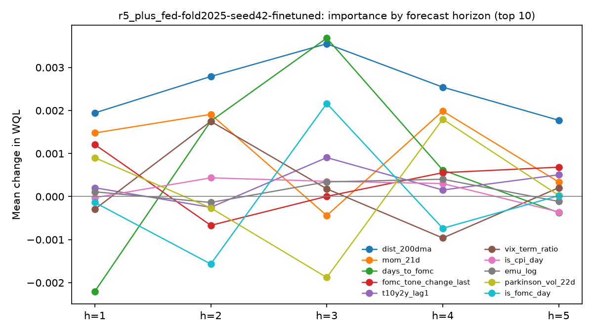

## r5_plus_fed-fold2025-seed42-pretrained

50 windows x 3 repeats; baseline mean WQL 0.706054.

| Rank | Feature | Mean dWQL | Relative | Std | Windows > 0 | H1 | H2 | H3 | H4 | H5 |
|---:|---|---:|---:|---:|---:|---:|---:|---:|---:|---:|
| 1 | `dist_200dma` | +0.00262 | +0.29% | 0.01127 | 64% | +0.00234 | +0.00314 | +0.00306 | +0.00295 | +0.00162 |
| 2 | `days_to_fomc` (known-future) | +0.00189 | +0.25% | 0.02265 | 57% | -0.00202 | +0.00428 | +0.00594 | +0.00163 | -0.00038 |
| 3 | `vix_term_ratio` | +0.00140 | +0.17% | 0.00682 | 57% | +0.00308 | +0.00328 | +0.00064 | -0.00052 | +0.00051 |
| 4 | `mom_21d` | +0.00139 | +0.14% | 0.01171 | 55% | +0.00305 | +0.00247 | -0.00274 | +0.00362 | +0.00055 |
| 5 | `parkinson_vol_22d` | +0.00103 | +0.13% | 0.00783 | 53% | +0.00269 | -0.00022 | -0.00157 | +0.00363 | +0.00062 |
| 6 | `fomc_tone_change_last` | +0.00048 | +0.07% | 0.00495 | 52% | +0.00230 | -0.00061 | -0.00064 | +0.00027 | +0.00106 |
| 7 | `is_cpi_day` (known-future) | +0.00033 | +0.06% | 0.00443 | 50% | +0.00060 | +0.00098 | +0.00003 | +0.00059 | -0.00054 |
| 8 | `t10y2y_lag1` | +0.00031 | +0.03% | 0.00243 | 51% | +0.00034 | -0.00083 | +0.00143 | +0.00018 | +0.00042 |
| 9 | `emu_log` | +0.00021 | +0.02% | 0.00303 | 56% | +0.00067 | +0.00037 | +0.00003 | +0.00025 | -0.00029 |
| 10 | `d_dgs2_bp` | -0.00001 | -0.02% | 0.00556 | 53% | -0.00190 | +0.00056 | +0.00198 | +0.00037 | -0.00108 |
| 11 | `fomc_net_hawkish_ewma` | -0.00008 | -0.01% | 0.00211 | 56% | -0.00056 | +0.00045 | -0.00028 | +0.00002 | -0.00003 |
| 12 | `days_to_month_end` (known-future) | -0.00016 | -0.01% | 0.00383 | 50% | -0.00056 | +0.00005 | +0.00067 | -0.00024 | -0.00073 |
| 13 | `cpi_yoy` | -0.00019 | -0.02% | 0.00216 | 44% | -0.00006 | -0.00001 | -0.00028 | -0.00047 | -0.00012 |
| 14 | `is_nfp_day` (known-future) | -0.00027 | -0.07% | 0.01010 | 47% | -0.00129 | +0.00231 | -0.00353 | +0.00070 | +0.00046 |
| 15 | `fomc_net_hawkish_last` | -0.00028 | -0.04% | 0.00251 | 42% | -0.00157 | +0.00047 | -0.00099 | +0.00042 | +0.00026 |
| 16 | `is_fomc_day` (known-future) | -0.00031 | -0.06% | 0.00655 | 55% | +0.00119 | -0.00280 | +0.00305 | -0.00174 | -0.00127 |
| 17 | `epu_log` | -0.00036 | -0.06% | 0.00367 | 46% | -0.00006 | -0.00044 | +0.00015 | -0.00013 | -0.00130 |
| 18 | `is_opex_week` (known-future) | -0.00047 | -0.06% | 0.00418 | 45% | -0.00108 | -0.00084 | -0.00032 | -0.00095 | +0.00083 |
| 19 | `vxn_minus_vix` | -0.00054 | -0.06% | 0.00639 | 47% | +0.00074 | +0.00122 | -0.00249 | -0.00235 | +0.00019 |
| 20 | `days_since_fomc` | -0.00074 | -0.13% | 0.00493 | 48% | +0.00015 | -0.00129 | -0.00067 | -0.00084 | -0.00104 |
| 21 | `volume_z_20d` | -0.00111 | -0.15% | 0.00643 | 46% | -0.00099 | -0.00256 | +0.00044 | -0.00030 | -0.00213 |
| 22 | `tlt_log_ret` | -0.00159 | -0.23% | 0.00727 | 39% | -0.00208 | -0.00246 | -0.00003 | +0.00015 | -0.00351 |
| 23 | `parkinson_vol_1d` | -0.00163 | -0.23% | 0.02645 | 55% | -0.00031 | -0.00859 | -0.00317 | -0.00077 | +0.00467 |
| 24 | `d_dfii10_bp` | -0.00169 | -0.26% | 0.00798 | 39% | -0.00248 | -0.00301 | -0.00071 | +0.00008 | -0.00231 |
| 25 | `hyg_log_ret` | -0.00282 | -0.36% | 0.03237 | 53% | -0.00318 | -0.00503 | -0.00079 | -0.00502 | -0.00006 |
| 26 | `overnight_gap` | -0.00477 | -0.72% | 0.03953 | 56% | -0.00721 | +0.00111 | -0.01166 | -0.00062 | -0.00547 |
| 27 | `vxn_log_chg` | -0.00833 | -0.97% | 0.06590 | 49% | -0.00175 | -0.01815 | +0.00288 | -0.02638 | +0.00178 |

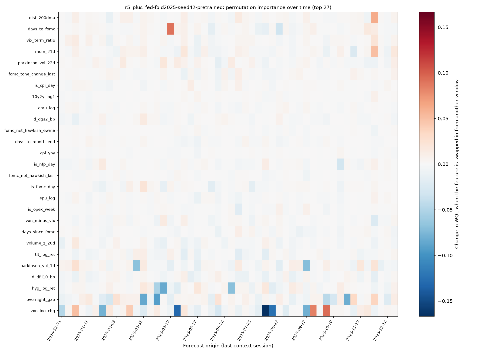

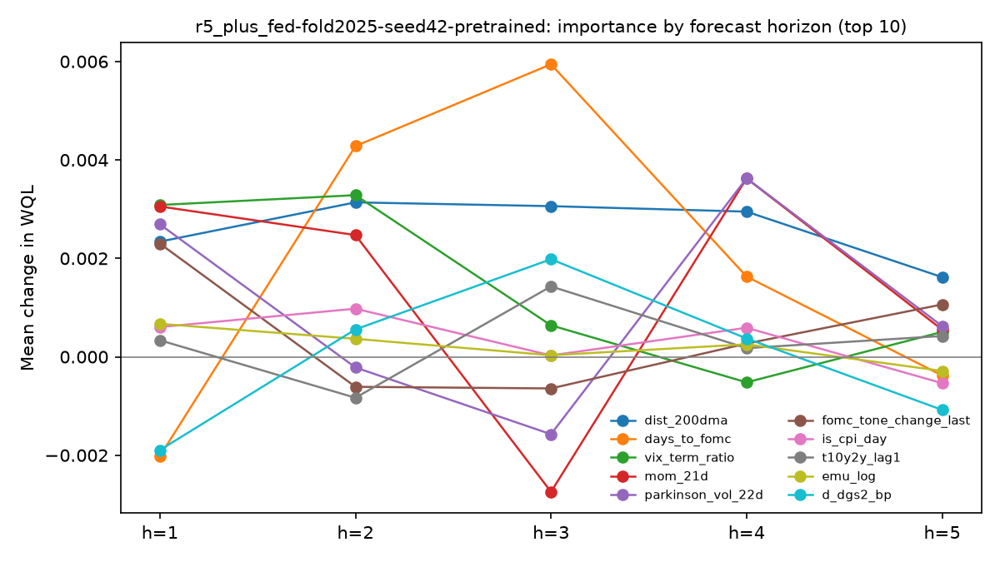

## r7_all_external-fold2022-seed42-bw4-finetuned

50 windows x 3 repeats; baseline mean WQL 0.696617.

| Rank | Feature | Mean dWQL | Relative | Std | Windows > 0 | H1 | H2 | H3 | H4 | H5 |
|---:|---|---:|---:|---:|---:|---:|---:|---:|---:|---:|
| 1 | `hyg_log_ret` | +0.00109 | +0.17% | 0.00734 | 52% | +0.00413 | +0.00362 | -0.00094 | -0.00195 | +0.00058 |
| 2 | `gdelt_big_tech_earnings_news_share` | +0.00071 | +0.11% | 0.00379 | 55% | +0.00042 | +0.00051 | +0.00159 | +0.00097 | +0.00004 |
| 3 | `gdelt_fed_news_share` | +0.00061 | +0.08% | 0.00449 | 55% | +0.00200 | +0.00152 | +0.00103 | -0.00074 | -0.00074 |
| 4 | `is_nfp_day` (known-future) | +0.00050 | +0.07% | 0.00328 | 57% | +0.00185 | +0.00025 | -0.00004 | +0.00007 | +0.00035 |
| 5 | `gdelt_recession_avg_tone` | +0.00046 | +0.08% | 0.00446 | 48% | +0.00150 | +0.00064 | -0.00083 | +0.00092 | +0.00006 |
| 6 | `ndx_earnings_count` | +0.00039 | +0.05% | 0.00281 | 54% | +0.00044 | +0.00074 | -0.00030 | +0.00076 | +0.00032 |
| 7 | `gdelt_recession_news_share` | +0.00038 | +0.05% | 0.00388 | 58% | +0.00042 | +0.00150 | +0.00193 | -0.00107 | -0.00088 |
| 8 | `gdelt_ai_news_share` | +0.00037 | +0.05% | 0.00381 | 50% | -0.00009 | +0.00071 | +0.00072 | +0.00075 | -0.00025 |
| 9 | `d_dgs2_bp` | +0.00033 | +0.07% | 0.01686 | 54% | -0.00296 | -0.00125 | -0.00049 | +0.00475 | +0.00161 |
| 10 | `parkinson_vol_1d` | +0.00031 | +0.10% | 0.02777 | 42% | +0.00358 | -0.00438 | -0.00103 | +0.00264 | +0.00076 |
| 11 | `gdelt_semiconductor_avg_tone` | +0.00026 | +0.04% | 0.00440 | 56% | -0.00157 | +0.00154 | -0.00057 | +0.00204 | -0.00014 |
| 12 | `sec_total_filings` | +0.00026 | +0.03% | 0.00614 | 49% | +0.00261 | +0.00128 | +0.00017 | -0.00180 | -0.00096 |
| 13 | `is_opex_week` (known-future) | +0.00023 | +0.03% | 0.00182 | 53% | +0.00042 | +0.00007 | +0.00028 | +0.00063 | -0.00025 |
| 14 | `d_dfii10_bp` | +0.00021 | +0.03% | 0.00713 | 47% | -0.00178 | +0.00097 | +0.00085 | +0.00070 | +0.00032 |
| 15 | `gdelt_fed_avg_tone` | +0.00012 | +0.03% | 0.00413 | 59% | +0.00168 | -0.00028 | -0.00044 | +0.00011 | -0.00047 |
| 16 | `fomc_net_hawkish_last` | +0.00010 | +0.01% | 0.00077 | 61% | +0.00009 | +0.00020 | +0.00015 | +0.00005 | +0.00003 |
| 17 | `gdelt_inflation_avg_tone` | +0.00009 | +0.01% | 0.00433 | 44% | -0.00063 | +0.00013 | +0.00006 | +0.00028 | +0.00062 |
| 18 | `gdelt_big_tech_earnings_avg_tone` | +0.00005 | +0.00% | 0.00342 | 41% | -0.00025 | +0.00026 | -0.00094 | +0.00134 | -0.00016 |
| 19 | `fomc_net_hawkish_ewma` | +0.00004 | +0.00% | 0.00067 | 51% | -0.00017 | +0.00027 | -0.00012 | +0.00006 | +0.00015 |
| 20 | `fomc_tone_change_last` | +0.00001 | -0.00% | 0.00194 | 53% | +0.00003 | +0.00043 | -0.00003 | -0.00016 | -0.00023 |
| 21 | `tlt_log_ret` | -0.00002 | +0.03% | 0.00859 | 52% | -0.00019 | -0.00167 | -0.00006 | +0.00233 | -0.00049 |
| 22 | `days_since_fomc` | -0.00003 | -0.00% | 0.00293 | 53% | -0.00092 | +0.00017 | +0.00085 | +0.00031 | -0.00053 |
| 23 | `emu_log` | -0.00004 | +0.00% | 0.00249 | 47% | +0.00150 | -0.00091 | -0.00080 | -0.00025 | +0.00025 |
| 24 | `is_cpi_day` (known-future) | -0.00005 | -0.01% | 0.00312 | 44% | -0.00041 | -0.00074 | +0.00026 | +0.00043 | +0.00023 |
| 25 | `epu_log` | -0.00005 | +0.00% | 0.00183 | 44% | +0.00050 | -0.00092 | -0.00016 | +0.00011 | +0.00021 |
| 26 | `vxn_minus_vix` | -0.00007 | -0.00% | 0.00307 | 58% | -0.00049 | -0.00006 | +0.00030 | +0.00028 | -0.00037 |
| 27 | `t10y2y_lag1` | -0.00008 | -0.01% | 0.00120 | 43% | -0.00037 | +0.00030 | +0.00004 | -0.00006 | -0.00029 |
| 28 | `cpi_yoy` | -0.00013 | -0.02% | 0.00097 | 47% | -0.00042 | -0.00022 | -0.00017 | +0.00009 | +0.00005 |
| 29 | `days_to_month_end` (known-future) | -0.00015 | -0.02% | 0.00194 | 47% | +0.00073 | +0.00008 | -0.00027 | -0.00077 | -0.00049 |
| 30 | `days_to_fomc` (known-future) | -0.00016 | -0.02% | 0.00241 | 45% | +0.00026 | +0.00001 | -0.00071 | -0.00043 | +0.00006 |
| 31 | `vix_term_ratio` | -0.00024 | -0.03% | 0.00329 | 47% | +0.00104 | -0.00061 | +0.00018 | -0.00027 | -0.00155 |
| 32 | `dist_200dma` | -0.00033 | -0.04% | 0.00245 | 45% | -0.00147 | +0.00086 | +0.00014 | -0.00112 | -0.00007 |
| 33 | `mom_21d` | -0.00036 | -0.04% | 0.00539 | 46% | -0.00168 | +0.00088 | +0.00015 | -0.00008 | -0.00104 |
| 34 | `gdelt_inflation_news_share` | -0.00039 | -0.06% | 0.00250 | 47% | -0.00104 | +0.00072 | +0.00036 | -0.00126 | -0.00075 |
| 35 | `is_fomc_day` (known-future) | -0.00040 | -0.06% | 0.00208 | 43% | -0.00073 | -0.00019 | +0.00004 | -0.00035 | -0.00077 |
| 36 | `parkinson_vol_22d` | -0.00049 | -0.07% | 0.00418 | 39% | +0.00015 | -0.00054 | -0.00169 | -0.00061 | +0.00026 |
| 37 | `gdelt_semiconductor_news_share` | -0.00056 | -0.08% | 0.00428 | 46% | -0.00058 | -0.00062 | -0.00074 | -0.00104 | +0.00015 |
| 38 | `volume_z_20d` | -0.00058 | -0.07% | 0.00532 | 53% | -0.00164 | -0.00043 | -0.00078 | +0.00002 | -0.00009 |
| 39 | `sec_8k_count` | -0.00064 | -0.09% | 0.00633 | 41% | -0.00179 | -0.00015 | +0.00212 | -0.00007 | -0.00328 |
| 40 | `gdelt_ai_avg_tone` | -0.00079 | -0.11% | 0.00432 | 48% | -0.00161 | -0.00191 | +0.00002 | -0.00088 | +0.00044 |
| 41 | `overnight_gap` | -0.00222 | -0.36% | 0.04816 | 46% | -0.00600 | +0.00577 | -0.00327 | -0.00613 | -0.00146 |
| 42 | `vxn_log_chg` | -0.00358 | -0.44% | 0.03288 | 51% | -0.00180 | -0.00531 | -0.00830 | -0.00325 | +0.00077 |

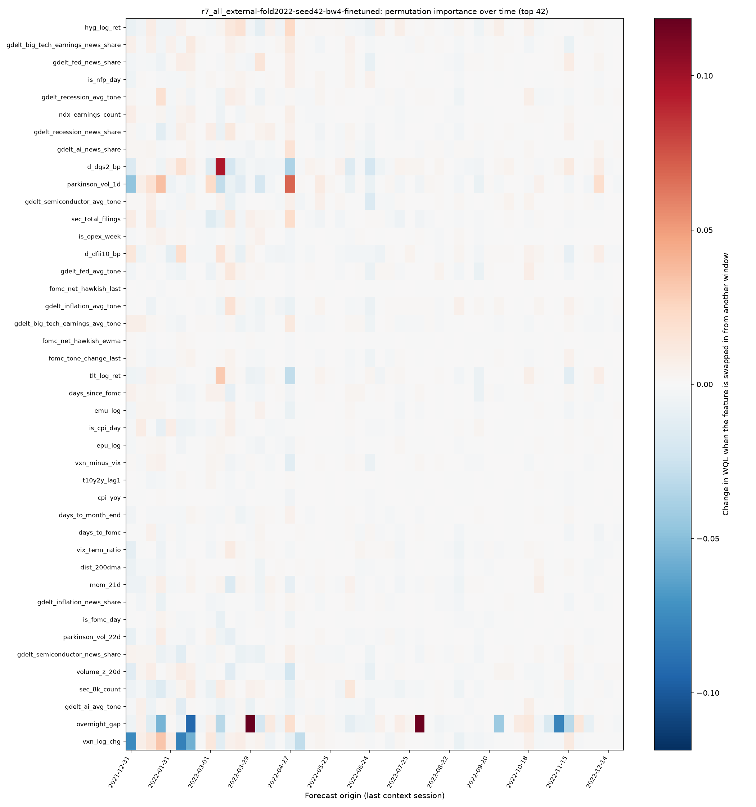

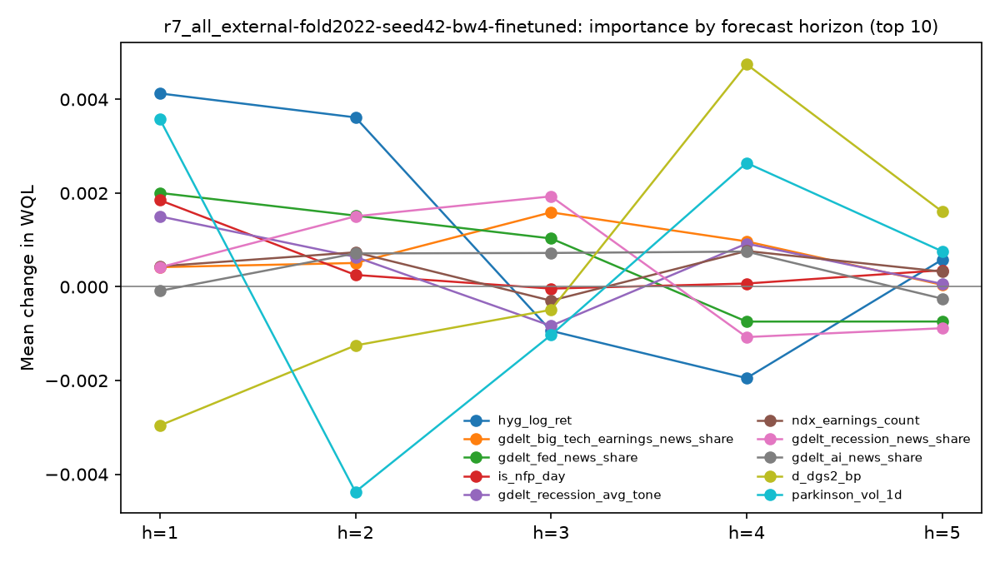

## r7_all_external-fold2022-seed42-bw4-pretrained

50 windows x 3 repeats; baseline mean WQL 0.700148.

| Rank | Feature | Mean dWQL | Relative | Std | Windows > 0 | H1 | H2 | H3 | H4 | H5 |
|---:|---|---:|---:|---:|---:|---:|---:|---:|---:|---:|
| 1 | `gdelt_semiconductor_avg_tone` | +0.00124 | +0.20% | 0.00784 | 51% | -0.00104 | +0.00103 | +0.00092 | +0.00385 | +0.00141 |
| 2 | `is_nfp_day` (known-future) | +0.00118 | +0.19% | 0.00566 | 61% | +0.00374 | -0.00049 | +0.00015 | +0.00100 | +0.00150 |
| 3 | `gdelt_big_tech_earnings_news_share` | +0.00117 | +0.17% | 0.00580 | 59% | +0.00133 | -0.00084 | +0.00203 | +0.00347 | -0.00012 |
| 4 | `hyg_log_ret` | +0.00113 | +0.18% | 0.01136 | 54% | +0.00596 | +0.00479 | -0.00271 | -0.00501 | +0.00260 |
| 5 | `gdelt_fed_news_share` | +0.00107 | +0.14% | 0.00553 | 56% | +0.00216 | +0.00174 | +0.00192 | -0.00028 | -0.00021 |
| 6 | `parkinson_vol_1d` | +0.00093 | +0.24% | 0.03398 | 43% | +0.00422 | -0.00740 | +0.00038 | +0.00603 | +0.00141 |
| 7 | `gdelt_recession_news_share` | +0.00082 | +0.09% | 0.00572 | 55% | +0.00006 | +0.00274 | +0.00398 | -0.00187 | -0.00078 |
| 8 | `tlt_log_ret` | +0.00065 | +0.14% | 0.01204 | 59% | +0.00142 | -0.00141 | +0.00065 | +0.00315 | -0.00058 |
| 9 | `ndx_earnings_count` | +0.00062 | +0.08% | 0.00429 | 51% | +0.00144 | +0.00034 | -0.00077 | +0.00109 | +0.00099 |
| 10 | `gdelt_recession_avg_tone` | +0.00054 | +0.10% | 0.00593 | 49% | +0.00313 | +0.00001 | -0.00197 | +0.00027 | +0.00128 |
| 11 | `vxn_minus_vix` | +0.00051 | +0.08% | 0.00318 | 53% | +0.00091 | +0.00073 | +0.00019 | +0.00053 | +0.00020 |
| 12 | `gdelt_fed_avg_tone` | +0.00048 | +0.08% | 0.00427 | 57% | +0.00118 | +0.00087 | -0.00017 | +0.00078 | -0.00025 |
| 13 | `gdelt_ai_news_share` | +0.00025 | +0.04% | 0.00523 | 51% | -0.00085 | +0.00046 | +0.00042 | +0.00096 | +0.00026 |
| 14 | `fomc_net_hawkish_last` | +0.00016 | +0.02% | 0.00113 | 54% | -0.00002 | +0.00031 | +0.00045 | +0.00007 | -0.00001 |
| 15 | `fomc_tone_change_last` | +0.00010 | +0.01% | 0.00236 | 49% | -0.00020 | +0.00046 | +0.00057 | +0.00011 | -0.00047 |
| 16 | `is_opex_week` (known-future) | +0.00008 | +0.01% | 0.00310 | 48% | +0.00028 | -0.00063 | +0.00036 | +0.00083 | -0.00045 |
| 17 | `fomc_net_hawkish_ewma` | +0.00006 | +0.01% | 0.00109 | 46% | -0.00010 | +0.00043 | -0.00013 | -0.00010 | +0.00022 |
| 18 | `gdelt_inflation_avg_tone` | +0.00004 | +0.01% | 0.00559 | 49% | +0.00054 | +0.00026 | -0.00140 | -0.00017 | +0.00096 |
| 19 | `cpi_yoy` | +0.00001 | +0.00% | 0.00098 | 54% | -0.00005 | -0.00010 | +0.00005 | -0.00005 | +0.00020 |
| 20 | `days_to_month_end` (known-future) | -0.00003 | -0.02% | 0.00341 | 44% | +0.00084 | +0.00010 | +0.00001 | -0.00034 | -0.00078 |
| 21 | `t10y2y_lag1` | -0.00005 | -0.01% | 0.00209 | 47% | -0.00009 | +0.00053 | -0.00039 | +0.00017 | -0.00048 |
| 22 | `epu_log` | -0.00005 | +0.01% | 0.00311 | 49% | +0.00084 | -0.00134 | -0.00043 | +0.00006 | +0.00061 |
| 23 | `mom_21d` | -0.00005 | +0.02% | 0.01027 | 47% | -0.00047 | +0.00202 | -0.00052 | -0.00018 | -0.00111 |
| 24 | `d_dfii10_bp` | -0.00010 | -0.04% | 0.01424 | 49% | -0.00402 | +0.00286 | +0.00019 | +0.00002 | +0.00048 |
| 25 | `emu_log` | -0.00012 | -0.01% | 0.00361 | 46% | +0.00245 | -0.00082 | -0.00231 | -0.00033 | +0.00040 |
| 26 | `sec_total_filings` | -0.00018 | -0.05% | 0.00845 | 51% | +0.00221 | -0.00017 | +0.00091 | -0.00264 | -0.00123 |
| 27 | `volume_z_20d` | -0.00021 | -0.01% | 0.00703 | 51% | -0.00185 | -0.00051 | -0.00029 | -0.00002 | +0.00163 |
| 28 | `dist_200dma` | -0.00021 | -0.03% | 0.00457 | 49% | -0.00094 | +0.00234 | -0.00018 | -0.00208 | -0.00019 |
| 29 | `days_since_fomc` | -0.00029 | -0.04% | 0.00521 | 50% | -0.00194 | +0.00085 | +0.00026 | -0.00015 | -0.00045 |
| 30 | `is_cpi_day` (known-future) | -0.00031 | -0.06% | 0.00575 | 48% | -0.00148 | -0.00088 | -0.00060 | +0.00176 | -0.00034 |
| 31 | `d_dgs2_bp` | -0.00041 | +0.01% | 0.02285 | 47% | -0.00327 | -0.00370 | -0.00179 | +0.00302 | +0.00367 |
| 32 | `gdelt_big_tech_earnings_avg_tone` | -0.00052 | -0.08% | 0.00511 | 45% | -0.00143 | -0.00115 | -0.00195 | +0.00159 | +0.00032 |
| 33 | `days_to_fomc` (known-future) | -0.00059 | -0.09% | 0.00448 | 45% | -0.00107 | -0.00000 | -0.00098 | -0.00090 | -0.00003 |
| 34 | `gdelt_inflation_news_share` | -0.00060 | -0.08% | 0.00416 | 47% | -0.00239 | +0.00093 | +0.00092 | -0.00173 | -0.00070 |
| 35 | `vix_term_ratio` | -0.00069 | -0.09% | 0.00499 | 45% | +0.00097 | -0.00044 | -0.00144 | -0.00004 | -0.00247 |
| 36 | `parkinson_vol_22d` | -0.00079 | -0.10% | 0.00560 | 41% | +0.00104 | -0.00184 | -0.00273 | -0.00062 | +0.00017 |
| 37 | `is_fomc_day` (known-future) | -0.00091 | -0.12% | 0.00390 | 43% | -0.00096 | -0.00032 | -0.00133 | -0.00096 | -0.00099 |
| 38 | `gdelt_ai_avg_tone` | -0.00099 | -0.12% | 0.00734 | 47% | -0.00087 | -0.00275 | +0.00058 | -0.00286 | +0.00093 |
| 39 | `gdelt_semiconductor_news_share` | -0.00115 | -0.15% | 0.00645 | 43% | -0.00228 | -0.00338 | -0.00190 | +0.00072 | +0.00108 |
| 40 | `sec_8k_count` | -0.00129 | -0.20% | 0.00927 | 40% | -0.00256 | -0.00446 | +0.00260 | +0.00096 | -0.00300 |
| 41 | `overnight_gap` | -0.00245 | -0.32% | 0.05488 | 49% | -0.00473 | +0.00271 | -0.00461 | -0.00605 | +0.00045 |
| 42 | `vxn_log_chg` | -0.00591 | -0.72% | 0.04053 | 49% | -0.00364 | -0.00973 | -0.01292 | -0.00272 | -0.00053 |

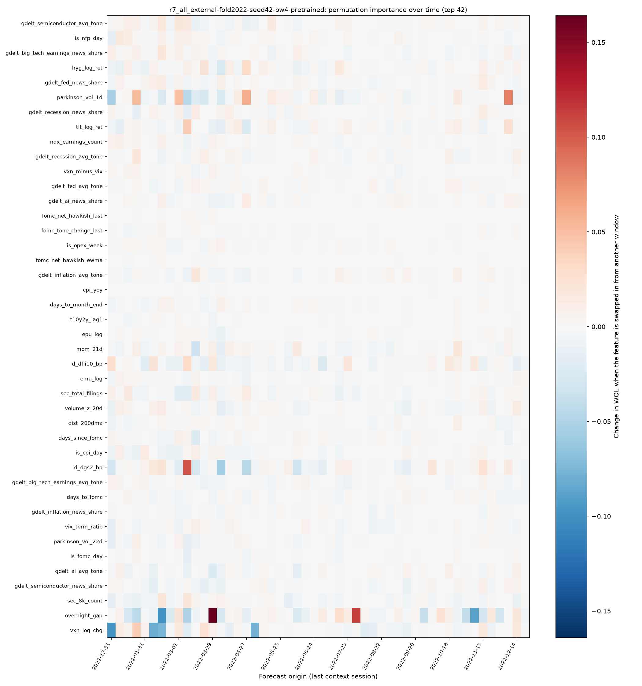

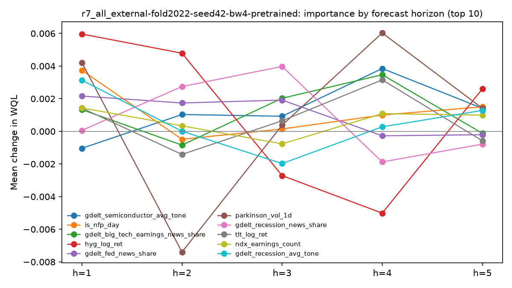

## r7_all_external-fold2025-seed42-bw4-finetuned

50 windows x 3 repeats; baseline mean WQL 0.710875.

| Rank | Feature | Mean dWQL | Relative | Std | Windows > 0 | H1 | H2 | H3 | H4 | H5 |
|---:|---|---:|---:|---:|---:|---:|---:|---:|---:|---:|
| 1 | `sec_total_filings` | +0.00160 | +0.19% | 0.01123 | 58% | +0.00083 | +0.00118 | +0.00170 | +0.00263 | +0.00166 |
| 2 | `dist_200dma` | +0.00122 | +0.13% | 0.00560 | 55% | +0.00164 | +0.00093 | +0.00031 | +0.00207 | +0.00114 |
| 3 | `gdelt_ai_news_share` | +0.00121 | +0.14% | 0.00541 | 60% | +0.00025 | +0.00407 | +0.00081 | +0.00008 | +0.00085 |
| 4 | `gdelt_recession_news_share` | +0.00054 | +0.06% | 0.00446 | 58% | +0.00191 | +0.00095 | -0.00085 | -0.00049 | +0.00117 |
| 5 | `gdelt_ai_avg_tone` | +0.00049 | +0.06% | 0.00320 | 55% | +0.00095 | +0.00235 | -0.00037 | -0.00103 | +0.00054 |
| 6 | `sec_8k_count` | +0.00041 | +0.07% | 0.00321 | 52% | -0.00105 | +0.00091 | +0.00083 | +0.00070 | +0.00064 |
| 7 | `ndx_earnings_count` | +0.00038 | +0.05% | 0.00416 | 49% | +0.00079 | -0.00058 | +0.00117 | +0.00027 | +0.00025 |
| 8 | `gdelt_big_tech_earnings_avg_tone` | +0.00037 | +0.01% | 0.00624 | 47% | +0.00077 | +0.00112 | -0.00018 | +0.00000 | +0.00017 |
| 9 | `gdelt_inflation_news_share` | +0.00036 | +0.04% | 0.00285 | 56% | +0.00065 | +0.00155 | +0.00025 | -0.00065 | -0.00000 |
| 10 | `vxn_minus_vix` | +0.00033 | +0.05% | 0.00314 | 53% | +0.00017 | +0.00138 | -0.00017 | +0.00012 | +0.00015 |
| 11 | `fomc_tone_change_last` | +0.00030 | +0.04% | 0.00203 | 55% | +0.00060 | +0.00018 | -0.00003 | +0.00042 | +0.00033 |
| 12 | `parkinson_vol_22d` | +0.00030 | +0.03% | 0.00329 | 51% | +0.00071 | -0.00045 | -0.00027 | +0.00093 | +0.00058 |
| 13 | `mom_21d` | +0.00025 | -0.00% | 0.00464 | 47% | +0.00132 | -0.00118 | -0.00059 | +0.00098 | +0.00071 |
| 14 | `gdelt_fed_avg_tone` | +0.00022 | +0.02% | 0.00465 | 59% | -0.00140 | +0.00233 | -0.00020 | +0.00034 | +0.00003 |
| 15 | `vix_term_ratio` | +0.00019 | +0.01% | 0.00319 | 57% | +0.00006 | +0.00167 | -0.00024 | -0.00038 | -0.00015 |
| 16 | `gdelt_recession_avg_tone` | +0.00018 | +0.03% | 0.00495 | 50% | -0.00155 | +0.00181 | -0.00000 | +0.00008 | +0.00055 |
| 17 | `days_to_month_end` (known-future) | +0.00007 | +0.02% | 0.00207 | 53% | +0.00011 | +0.00051 | +0.00034 | -0.00030 | -0.00029 |
| 18 | `t10y2y_lag1` | +0.00005 | +0.00% | 0.00152 | 57% | +0.00045 | -0.00042 | -0.00003 | +0.00007 | +0.00020 |
| 19 | `is_nfp_day` (known-future) | +0.00003 | +0.00% | 0.00326 | 47% | -0.00107 | +0.00076 | +0.00019 | +0.00024 | +0.00005 |
| 20 | `d_dgs2_bp` | +0.00002 | +0.02% | 0.00485 | 52% | +0.00002 | +0.00144 | +0.00003 | -0.00048 | -0.00091 |
| 21 | `is_cpi_day` (known-future) | -0.00000 | +0.01% | 0.00216 | 51% | -0.00070 | +0.00097 | -0.00046 | +0.00041 | -0.00023 |
| 22 | `d_dfii10_bp` | -0.00001 | +0.01% | 0.00443 | 51% | -0.00077 | +0.00040 | +0.00012 | +0.00042 | -0.00022 |
| 23 | `fomc_net_hawkish_last` | -0.00005 | -0.01% | 0.00107 | 45% | -0.00004 | +0.00019 | -0.00042 | +0.00009 | -0.00007 |
| 24 | `days_since_fomc` | -0.00005 | -0.02% | 0.00239 | 46% | -0.00017 | +0.00054 | +0.00006 | -0.00045 | -0.00023 |
| 25 | `gdelt_inflation_avg_tone` | -0.00005 | -0.03% | 0.00570 | 47% | +0.00071 | +0.00119 | -0.00067 | -0.00090 | -0.00058 |
| 26 | `days_to_fomc` (known-future) | -0.00006 | -0.01% | 0.00551 | 50% | -0.00078 | +0.00002 | +0.00126 | +0.00026 | -0.00108 |
| 27 | `gdelt_semiconductor_news_share` | -0.00011 | -0.02% | 0.00346 | 51% | +0.00013 | +0.00061 | -0.00074 | -0.00023 | -0.00031 |
| 28 | `gdelt_big_tech_earnings_news_share` | -0.00012 | -0.02% | 0.00268 | 49% | +0.00063 | -0.00121 | -0.00000 | +0.00032 | -0.00033 |
| 29 | `fomc_net_hawkish_ewma` | -0.00013 | -0.01% | 0.00116 | 50% | -0.00012 | -0.00003 | -0.00021 | -0.00006 | -0.00025 |
| 30 | `is_opex_week` (known-future) | -0.00020 | -0.02% | 0.00176 | 41% | -0.00068 | -0.00047 | -0.00021 | -0.00023 | +0.00060 |
| 31 | `gdelt_fed_news_share` | -0.00020 | -0.03% | 0.00296 | 53% | +0.00102 | -0.00135 | +0.00032 | -0.00104 | +0.00005 |
| 32 | `emu_log` | -0.00022 | -0.03% | 0.00228 | 47% | +0.00008 | -0.00034 | -0.00035 | +0.00011 | -0.00059 |
| 33 | `epu_log` | -0.00023 | -0.04% | 0.00182 | 41% | -0.00042 | -0.00034 | -0.00005 | +0.00015 | -0.00048 |
| 34 | `cpi_yoy` | -0.00026 | -0.03% | 0.00136 | 36% | -0.00069 | -0.00009 | -0.00009 | -0.00020 | -0.00021 |
| 35 | `hyg_log_ret` | -0.00054 | -0.08% | 0.02449 | 61% | -0.00160 | +0.00173 | -0.00145 | -0.00307 | +0.00167 |
| 36 | `gdelt_semiconductor_avg_tone` | -0.00070 | -0.10% | 0.00445 | 47% | -0.00076 | -0.00035 | +0.00030 | -0.00144 | -0.00126 |
| 37 | `is_fomc_day` (known-future) | -0.00082 | -0.12% | 0.00470 | 52% | -0.00160 | -0.00174 | +0.00021 | -0.00030 | -0.00066 |
| 38 | `volume_z_20d` | -0.00087 | -0.11% | 0.00446 | 36% | -0.00164 | +0.00054 | -0.00104 | -0.00180 | -0.00043 |
| 39 | `tlt_log_ret` | -0.00110 | -0.13% | 0.00499 | 41% | -0.00033 | -0.00145 | -0.00136 | -0.00166 | -0.00072 |
| 40 | `parkinson_vol_1d` | -0.00123 | -0.18% | 0.01976 | 55% | -0.00279 | -0.00278 | -0.00013 | -0.00235 | +0.00192 |
| 41 | `overnight_gap` | -0.00231 | -0.33% | 0.02141 | 47% | -0.00001 | -0.00250 | -0.00954 | -0.00992 | +0.01040 |
| 42 | `vxn_log_chg` | -0.00868 | -1.06% | 0.06311 | 46% | -0.00833 | -0.01716 | +0.00911 | -0.02636 | -0.00065 |

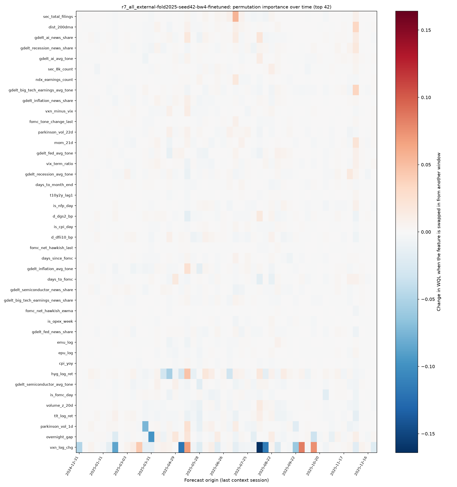

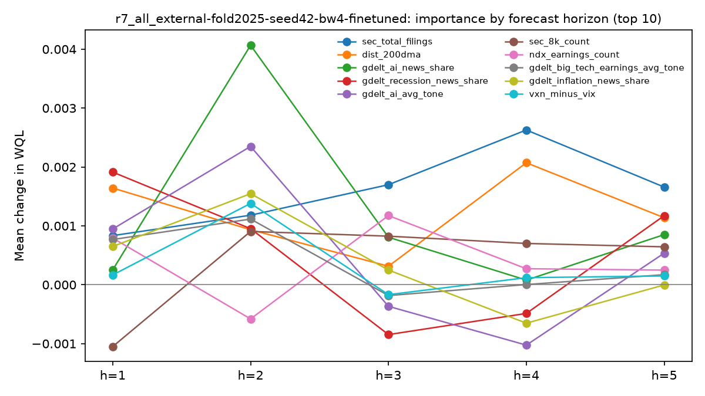

## r7_all_external-fold2025-seed42-bw4-pretrained

50 windows x 3 repeats; baseline mean WQL 0.706928.

| Rank | Feature | Mean dWQL | Relative | Std | Windows > 0 | H1 | H2 | H3 | H4 | H5 |
|---:|---|---:|---:|---:|---:|---:|---:|---:|---:|---:|
| 1 | `d_dgs2_bp` | +0.00171 | +0.27% | 0.01104 | 55% | +0.00440 | +0.00536 | -0.00181 | +0.00144 | -0.00085 |
| 2 | `sec_total_filings` | +0.00168 | +0.18% | 0.01823 | 57% | -0.00247 | +0.00099 | +0.00094 | +0.00572 | +0.00323 |
| 3 | `gdelt_ai_news_share` | +0.00162 | +0.25% | 0.00734 | 59% | +0.00351 | +0.00267 | +0.00210 | +0.00111 | -0.00127 |
| 4 | `gdelt_inflation_news_share` | +0.00130 | +0.18% | 0.00568 | 53% | +0.00047 | +0.00296 | +0.00203 | +0.00071 | +0.00032 |
| 5 | `days_to_fomc` (known-future) | +0.00129 | +0.14% | 0.01651 | 53% | +0.00013 | +0.00143 | +0.00508 | +0.00154 | -0.00174 |
| 6 | `gdelt_recession_news_share` | +0.00098 | +0.11% | 0.00745 | 63% | +0.00019 | +0.00406 | -0.00071 | -0.00128 | +0.00262 |
| 7 | `gdelt_fed_news_share` | +0.00083 | +0.06% | 0.00689 | 62% | +0.00268 | +0.00034 | +0.00174 | -0.00086 | +0.00025 |
| 8 | `parkinson_vol_22d` | +0.00080 | +0.09% | 0.00614 | 51% | +0.00082 | +0.00096 | -0.00028 | +0.00111 | +0.00140 |
| 9 | `ndx_earnings_count` | +0.00074 | +0.11% | 0.00684 | 58% | -0.00027 | -0.00011 | +0.00333 | -0.00051 | +0.00125 |
| 10 | `sec_8k_count` | +0.00072 | +0.12% | 0.00918 | 59% | -0.00164 | +0.00122 | +0.00251 | +0.00153 | -0.00000 |
| 11 | `fomc_tone_change_last` | +0.00068 | +0.10% | 0.00460 | 53% | +0.00199 | +0.00051 | -0.00023 | +0.00031 | +0.00082 |
| 12 | `dist_200dma` | +0.00056 | +0.03% | 0.00645 | 51% | -0.00028 | -0.00066 | +0.00015 | +0.00207 | +0.00155 |
| 13 | `gdelt_semiconductor_news_share` | +0.00052 | +0.08% | 0.00721 | 57% | +0.00278 | -0.00065 | -0.00047 | +0.00106 | -0.00012 |
| 14 | `gdelt_semiconductor_avg_tone` | +0.00050 | +0.09% | 0.00783 | 51% | -0.00029 | +0.00090 | +0.00279 | -0.00022 | -0.00068 |
| 15 | `is_cpi_day` (known-future) | +0.00048 | +0.08% | 0.00522 | 50% | +0.00040 | +0.00159 | +0.00036 | +0.00155 | -0.00148 |
| 16 | `t10y2y_lag1` | +0.00045 | +0.07% | 0.00226 | 54% | +0.00061 | -0.00004 | +0.00011 | +0.00036 | +0.00117 |
| 17 | `d_dfii10_bp` | +0.00029 | +0.09% | 0.01080 | 46% | +0.00171 | +0.00045 | -0.00270 | +0.00285 | -0.00085 |
| 18 | `days_to_month_end` (known-future) | +0.00022 | +0.03% | 0.00351 | 53% | -0.00022 | +0.00083 | +0.00106 | -0.00040 | -0.00016 |
| 19 | `gdelt_fed_avg_tone` | +0.00020 | -0.00% | 0.00828 | 56% | -0.00478 | +0.00433 | +0.00184 | +0.00104 | -0.00145 |
| 20 | `gdelt_inflation_avg_tone` | +0.00015 | +0.02% | 0.00712 | 52% | +0.00180 | +0.00073 | +0.00042 | -0.00027 | -0.00196 |
| 21 | `vix_term_ratio` | +0.00012 | -0.02% | 0.00493 | 48% | -0.00210 | +0.00217 | +0.00057 | -0.00118 | +0.00113 |
| 22 | `gdelt_recession_avg_tone` | +0.00008 | +0.01% | 0.00839 | 51% | -0.00511 | +0.00242 | -0.00003 | +0.00105 | +0.00208 |
| 23 | `gdelt_big_tech_earnings_news_share` | +0.00008 | +0.04% | 0.00644 | 47% | +0.00025 | +0.00047 | +0.00021 | -0.00008 | -0.00047 |
| 24 | `days_since_fomc` | +0.00004 | -0.03% | 0.00454 | 47% | -0.00048 | +0.00137 | +0.00017 | -0.00024 | -0.00061 |
| 25 | `gdelt_ai_avg_tone` | -0.00005 | +0.00% | 0.00605 | 50% | -0.00099 | +0.00108 | -0.00064 | +0.00007 | +0.00026 |
| 26 | `vxn_minus_vix` | -0.00005 | +0.02% | 0.00556 | 47% | +0.00064 | -0.00007 | -0.00173 | +0.00096 | -0.00005 |
| 27 | `emu_log` | -0.00008 | -0.02% | 0.00400 | 47% | -0.00070 | +0.00130 | -0.00046 | +0.00009 | -0.00064 |
| 28 | `fomc_net_hawkish_ewma` | -0.00014 | -0.01% | 0.00190 | 51% | -0.00053 | +0.00051 | -0.00038 | -0.00018 | -0.00011 |
| 29 | `fomc_net_hawkish_last` | -0.00022 | -0.03% | 0.00236 | 45% | -0.00030 | +0.00018 | -0.00159 | -0.00018 | +0.00075 |
| 30 | `is_opex_week` (known-future) | -0.00036 | -0.05% | 0.00321 | 47% | -0.00185 | +0.00008 | -0.00035 | -0.00034 | +0.00065 |
| 31 | `cpi_yoy` | -0.00044 | -0.05% | 0.00235 | 35% | -0.00070 | -0.00011 | -0.00018 | -0.00067 | -0.00054 |
| 32 | `volume_z_20d` | -0.00051 | +0.00% | 0.00779 | 47% | +0.00040 | +0.00154 | -0.00035 | -0.00233 | -0.00179 |
| 33 | `gdelt_big_tech_earnings_avg_tone` | -0.00051 | -0.13% | 0.00742 | 45% | -0.00064 | -0.00022 | -0.00013 | -0.00131 | -0.00027 |
| 34 | `epu_log` | -0.00053 | -0.06% | 0.00358 | 43% | -0.00079 | +0.00029 | -0.00140 | +0.00008 | -0.00084 |
| 35 | `mom_21d` | -0.00081 | -0.14% | 0.00717 | 45% | -0.00163 | -0.00226 | -0.00188 | +0.00090 | +0.00082 |
| 36 | `is_fomc_day` (known-future) | -0.00089 | -0.17% | 0.00863 | 51% | -0.00250 | +0.00095 | -0.00024 | -0.00103 | -0.00166 |
| 37 | `hyg_log_ret` | -0.00132 | -0.13% | 0.03389 | 54% | -0.00068 | +0.00033 | -0.00280 | -0.00276 | -0.00067 |
| 38 | `tlt_log_ret` | -0.00146 | -0.16% | 0.01013 | 48% | +0.00136 | -0.00399 | -0.00195 | -0.00123 | -0.00151 |
| 39 | `is_nfp_day` (known-future) | -0.00156 | -0.23% | 0.01058 | 43% | -0.00605 | -0.00068 | -0.00130 | -0.00139 | +0.00163 |
| 40 | `overnight_gap` | -0.00226 | -0.35% | 0.02983 | 56% | -0.00134 | -0.00263 | -0.01004 | -0.00523 | +0.00794 |
| 41 | `parkinson_vol_1d` | -0.00293 | -0.40% | 0.03265 | 56% | -0.00470 | -0.00853 | -0.00107 | -0.00272 | +0.00239 |
| 42 | `vxn_log_chg` | -0.00838 | -0.95% | 0.06823 | 51% | -0.00413 | -0.01388 | +0.01217 | -0.03126 | -0.00480 |

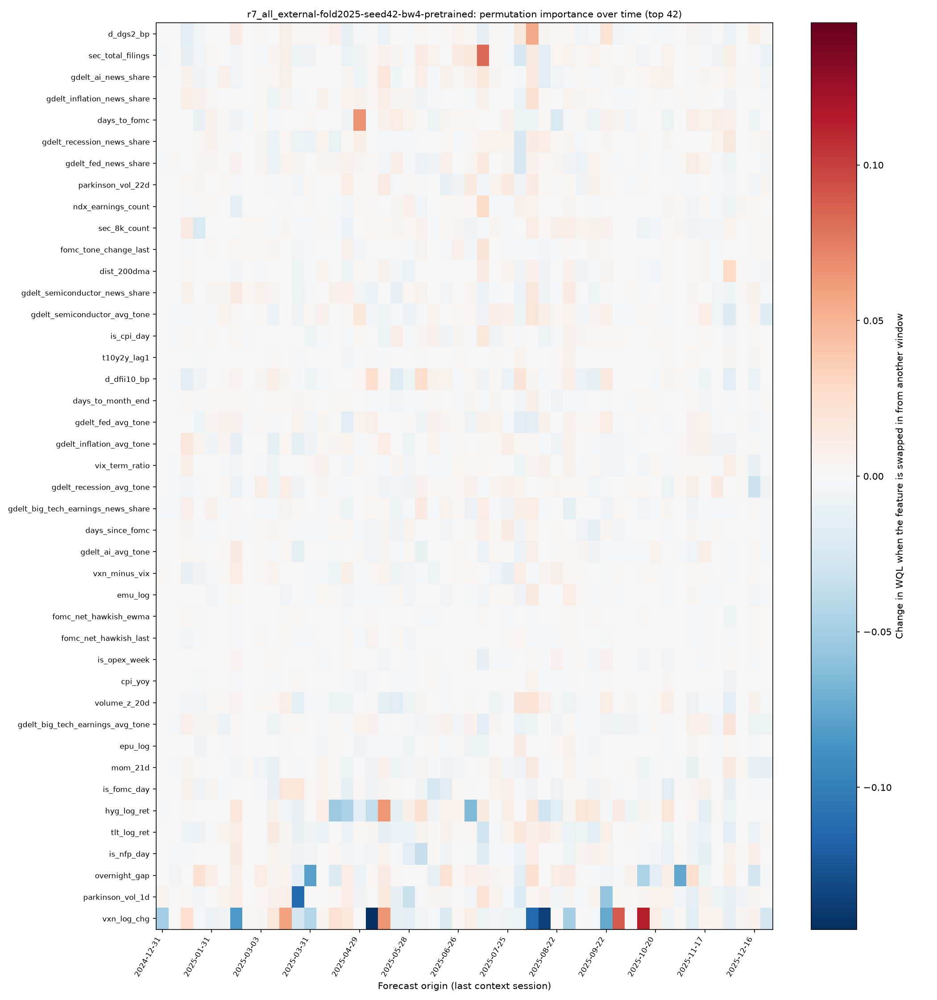

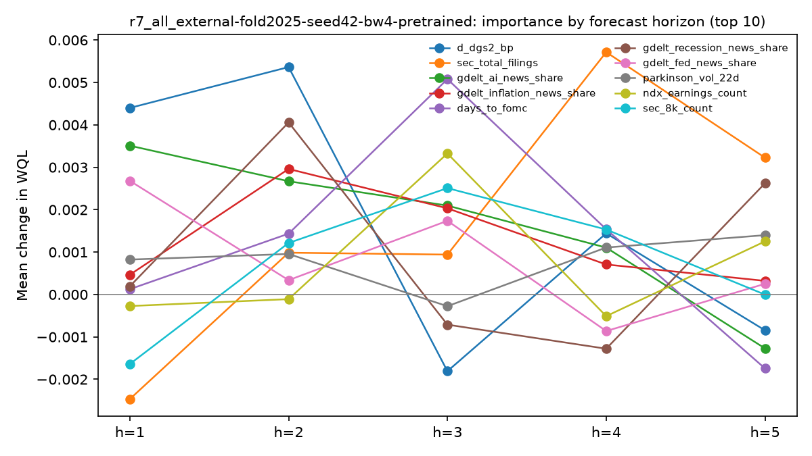
