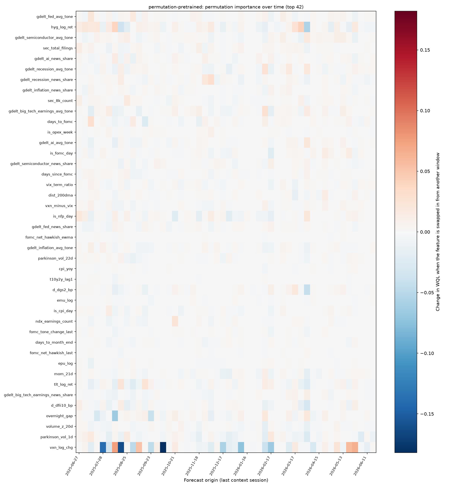
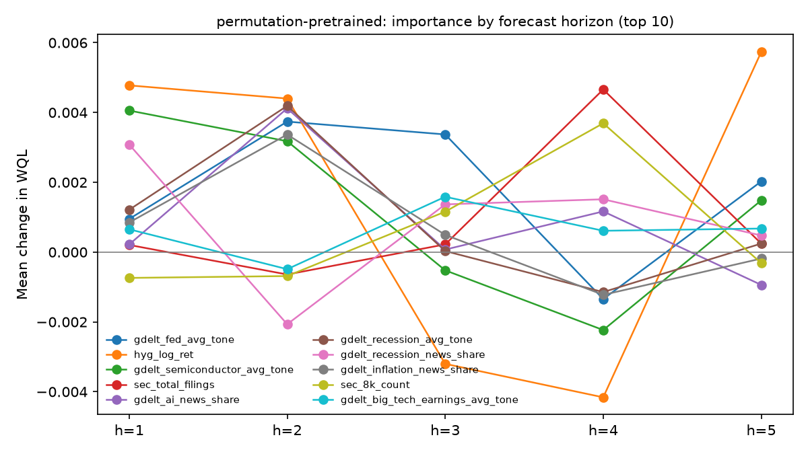

# Permutation importance (swap between validation windows)

Positive values: the forecast got worse when the feature was replaced by the same feature from another window, i.e. the model was using it. Relative = mean of dWQL / baseline WQL per window.

## permutation-pretrained

50 windows x 3 repeats; baseline mean WQL 0.691080.

| Rank | Feature | Mean dWQL | Relative | Std | Windows > 0 | H1 | H2 | H3 | H4 | H5 |
|---:|---|---:|---:|---:|---:|---:|---:|---:|---:|---:|
| 1 | `gdelt_fed_avg_tone` | +0.00175 | +0.25% | 0.00722 | 64% | +0.00095 | +0.00374 | +0.00337 | -0.00134 | +0.00203 |
| 2 | `hyg_log_ret` | +0.00151 | +0.28% | 0.02052 | 52% | +0.00478 | +0.00440 | -0.00320 | -0.00416 | +0.00574 |
| 3 | `gdelt_semiconductor_avg_tone` | +0.00119 | +0.19% | 0.00758 | 62% | +0.00406 | +0.00318 | -0.00052 | -0.00223 | +0.00148 |
| 4 | `sec_total_filings` | +0.00094 | +0.12% | 0.00692 | 51% | +0.00021 | -0.00064 | +0.00022 | +0.00466 | +0.00025 |
| 5 | `gdelt_ai_news_share` | +0.00093 | +0.14% | 0.00590 | 57% | +0.00022 | +0.00412 | +0.00007 | +0.00117 | -0.00094 |
| 6 | `gdelt_recession_avg_tone` | +0.00091 | +0.11% | 0.00872 | 59% | +0.00121 | +0.00419 | +0.00003 | -0.00114 | +0.00024 |
| 7 | `gdelt_recession_news_share` | +0.00087 | +0.12% | 0.00744 | 51% | +0.00308 | -0.00207 | +0.00137 | +0.00151 | +0.00048 |
| 8 | `gdelt_inflation_news_share` | +0.00066 | +0.11% | 0.00435 | 57% | +0.00085 | +0.00337 | +0.00049 | -0.00122 | -0.00019 |
| 9 | `sec_8k_count` | +0.00062 | +0.11% | 0.00630 | 55% | -0.00074 | -0.00069 | +0.00116 | +0.00369 | -0.00031 |
| 10 | `gdelt_big_tech_earnings_avg_tone` | +0.00061 | +0.08% | 0.00895 | 53% | +0.00065 | -0.00049 | +0.00159 | +0.00061 | +0.00067 |
| 11 | `days_to_fomc` (known-future) | +0.00059 | +0.06% | 0.01197 | 57% | +0.00641 | -0.00402 | -0.00052 | -0.00303 | +0.00412 |
| 12 | `is_opex_week` (known-future) | +0.00058 | +0.09% | 0.00267 | 54% | +0.00111 | -0.00048 | +0.00109 | +0.00070 | +0.00048 |
| 13 | `gdelt_ai_avg_tone` | +0.00046 | +0.05% | 0.00620 | 54% | +0.00152 | +0.00138 | +0.00046 | +0.00055 | -0.00164 |
| 14 | `is_fomc_day` (known-future) | +0.00045 | +0.06% | 0.00739 | 62% | +0.00390 | -0.00217 | -0.00066 | -0.00098 | +0.00217 |
| 15 | `gdelt_semiconductor_news_share` | +0.00044 | +0.07% | 0.00487 | 58% | +0.00130 | +0.00022 | +0.00041 | -0.00019 | +0.00047 |
| 16 | `days_since_fomc` | +0.00043 | +0.05% | 0.00369 | 58% | +0.00075 | +0.00029 | +0.00095 | -0.00107 | +0.00123 |
| 17 | `vix_term_ratio` | +0.00035 | +0.03% | 0.00517 | 59% | -0.00083 | +0.00164 | +0.00140 | -0.00004 | -0.00043 |
| 18 | `dist_200dma` | +0.00034 | +0.05% | 0.00608 | 61% | +0.00162 | -0.00106 | -0.00083 | +0.00274 | -0.00076 |
| 19 | `vxn_minus_vix` | +0.00024 | +0.03% | 0.00450 | 51% | -0.00092 | +0.00123 | -0.00040 | +0.00013 | +0.00119 |
| 20 | `is_nfp_day` (known-future) | +0.00022 | +0.02% | 0.01084 | 57% | +0.00244 | -0.00058 | -0.00291 | -0.00001 | +0.00214 |
| 21 | `gdelt_fed_news_share` | +0.00020 | +0.03% | 0.00483 | 57% | +0.00184 | +0.00112 | -0.00016 | -0.00148 | -0.00035 |
| 22 | `fomc_net_hawkish_ewma` | +0.00002 | +0.00% | 0.00112 | 49% | -0.00024 | -0.00004 | +0.00017 | +0.00020 | +0.00001 |
| 23 | `gdelt_inflation_avg_tone` | +0.00001 | +0.01% | 0.00535 | 52% | -0.00036 | +0.00227 | -0.00050 | -0.00252 | +0.00117 |
| 24 | `parkinson_vol_22d` | +0.00001 | -0.02% | 0.00509 | 55% | +0.00067 | -0.00134 | -0.00010 | +0.00004 | +0.00079 |
| 25 | `cpi_yoy` | -0.00002 | -0.00% | 0.00185 | 51% | +0.00108 | +0.00004 | -0.00069 | -0.00084 | +0.00032 |
| 26 | `t10y2y_lag1` | -0.00002 | -0.01% | 0.00165 | 51% | -0.00024 | +0.00038 | +0.00050 | -0.00049 | -0.00025 |
| 27 | `d_dgs2_bp` | -0.00004 | +0.02% | 0.01065 | 53% | -0.00006 | -0.00092 | +0.00148 | +0.00176 | -0.00246 |
| 28 | `emu_log` | -0.00007 | -0.01% | 0.00217 | 51% | -0.00086 | +0.00056 | +0.00067 | -0.00080 | +0.00010 |
| 29 | `is_cpi_day` (known-future) | -0.00008 | -0.00% | 0.00527 | 49% | +0.00069 | +0.00006 | +0.00059 | -0.00138 | -0.00035 |
| 30 | `ndx_earnings_count` | -0.00010 | +0.01% | 0.00585 | 48% | -0.00208 | +0.00082 | +0.00026 | +0.00156 | -0.00104 |
| 31 | `fomc_tone_change_last` | -0.00012 | -0.02% | 0.00301 | 50% | -0.00012 | +0.00088 | -0.00026 | -0.00109 | -0.00002 |
| 32 | `days_to_month_end` (known-future) | -0.00018 | -0.03% | 0.00305 | 52% | -0.00062 | +0.00225 | -0.00151 | -0.00053 | -0.00049 |
| 33 | `fomc_net_hawkish_last` | -0.00023 | -0.03% | 0.00195 | 38% | -0.00083 | +0.00026 | -0.00044 | +0.00024 | -0.00039 |
| 34 | `epu_log` | -0.00030 | -0.04% | 0.00273 | 47% | +0.00092 | -0.00005 | -0.00070 | -0.00055 | -0.00112 |
| 35 | `mom_21d` | -0.00066 | -0.09% | 0.00637 | 49% | -0.00062 | -0.00226 | -0.00147 | +0.00151 | -0.00049 |
| 36 | `tlt_log_ret` | -0.00069 | -0.10% | 0.01211 | 47% | -0.00474 | -0.00002 | +0.00153 | +0.00076 | -0.00096 |
| 37 | `gdelt_big_tech_earnings_news_share` | -0.00071 | -0.12% | 0.00489 | 41% | -0.00098 | -0.00029 | -0.00036 | +0.00080 | -0.00273 |
| 38 | `d_dfii10_bp` | -0.00117 | -0.16% | 0.01000 | 45% | -0.00430 | -0.00194 | +0.00141 | -0.00112 | +0.00010 |
| 39 | `overnight_gap` | -0.00129 | -0.18% | 0.01692 | 55% | -0.00462 | -0.00084 | +0.00175 | -0.00352 | +0.00078 |
| 40 | `volume_z_20d` | -0.00129 | -0.17% | 0.00618 | 39% | -0.00067 | -0.00058 | -0.00244 | -0.00268 | -0.00008 |
| 41 | `parkinson_vol_1d` | -0.00217 | -0.27% | 0.01188 | 41% | -0.00594 | -0.00412 | -0.00006 | -0.00497 | +0.00423 |
| 42 | `vxn_log_chg` | -0.01380 | -1.81% | 0.08119 | 41% | -0.00474 | -0.01910 | -0.01831 | -0.02449 | -0.00237 |

